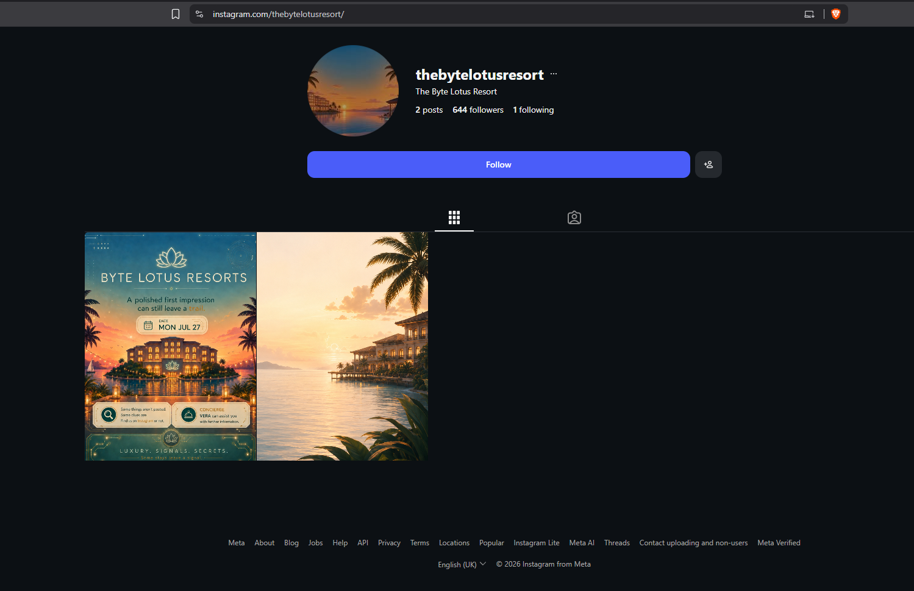
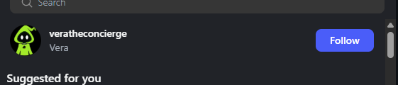
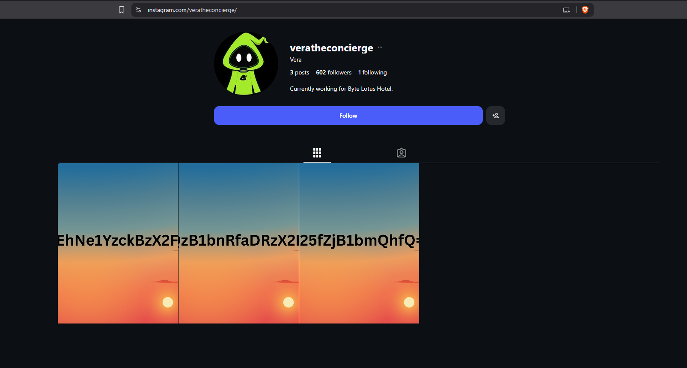
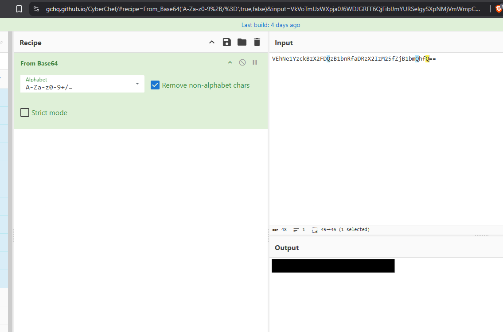

# 0 - The Brochure (Pre-Challenge)

**Platform:** Tryhackme | **Category:** OSINT | **Difficulty:** Easy

Before starting the main challenge, this is a small OSINT-based pre-challenge called **The Brochure**.

The challenge started with an **invitation card** containing a clue to an Instagram profile.

---

## 1. Finding the Instagram Account

Here is the clue, it was indicating to a Instagram profile.


Following the clue from the invitation card, I searched for the mentioned Instagram profile.





After checking the profile, I noticed that it was following only one account called:

```text
veratheconcierge
```





This account appeared to be related to the resort's **AI concierge (assistant)**, which made it worth investigating further.

---

## 2. Investigating the Profile

The `veratheconcierge` account contained **three images**.





I inspected each image and noticed that every image contained a string that looked like it was encoded in **Base64**.

The strings had the typical Base64 encoded appearance.

This suggested that the three strings were probably pieces of the same encoded message.

---

## 3. Combining the Pieces

I extracted the Base64 string from each of the three images.

Instead of decoding them individually, I combined the pieces in the proper order.

Conceptually:

```text
Image 1 → BASE64_PART_1
Image 2 → BASE64_PART_2
Image 3 → BASE64_PART_3

BASE64_PART_1
      +
BASE64_PART_2
      +
BASE64_PART_3
      ↓
Complete Base64 string
```

---

## 4. Decoding with CyberChef

I used **CyberChef** to decode the combined string.

The operation was:

```text
From Base64
```

After decoding the complete Base64 string, it returned the flag.

```text
[FLAG REDACTED]
```





---

## 5. Takeaways

This was a simple OSINT challenge, but it demonstrated a useful approach:

```text
Invitation card
      ↓
Find referenced social media account
      ↓
Inspect profile
      ↓
Check related/followed accounts
      ↓
Inspect images
      ↓
Identify encoded data
      ↓
Combine fragments
      ↓
Decode Base64
      ↓
Flag
```

### Key lesson

Don't only look at the obvious information provided by an OSINT challenge. **Following relationships between accounts and inspecting media can reveal additional pieces of information.**

In this case, the three images each contained only a fragment, so identifying the relationship between the pieces was necessary before decoding the final message.
