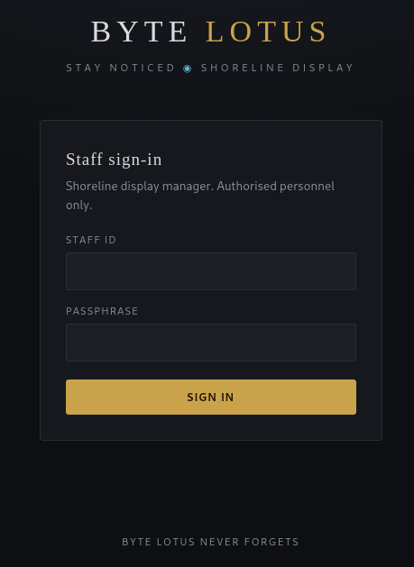
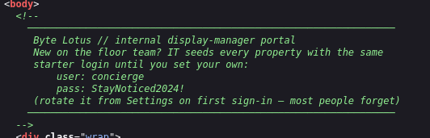
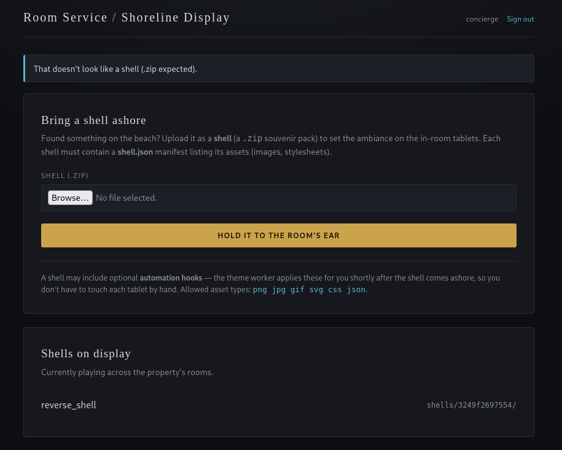
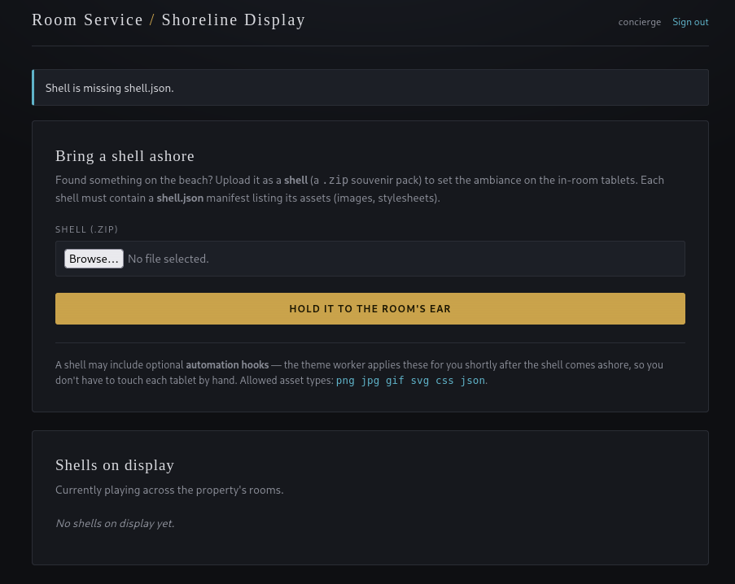
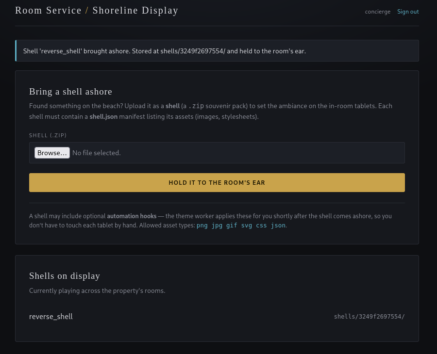
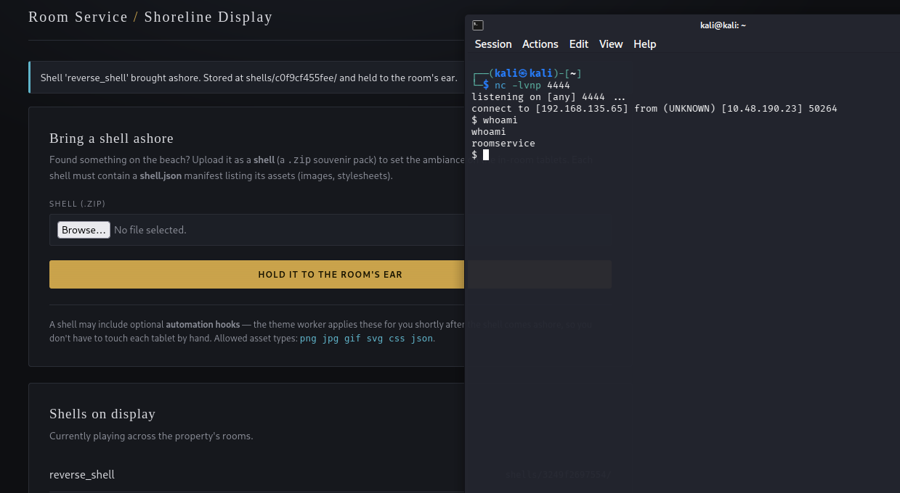
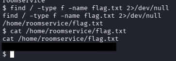

# 10 - The Hollow Shell

**Platform:** TryHackMe | **Category:** Web | **Difficulty:** Medium

---

## Objective

The challenge presented a login page with a file-upload functionality.

The goal was to understand the upload restrictions, bypass the intended ZIP extraction behavior, obtain remote code execution, and retrieve the flag.

---

# 1. Finding the Credentials

First comes the login page.



I started by inspecting the page source.

I found credentials directly in the source code:



```text
Username: concierge
Password: StayNoticed2024!
```

I used these credentials to log in successfully.

---

# 2. Investigating the File Upload

After logging in, I found a file-upload functionality.

The application had two main requirements:

```text
- File must be a .zip file
- ZIP must contain shell.json
```

The application even returned messages indicating the expected format:



```text
"That doesn't look like a shell (.zip expected)."
```

and:



```text
"Shell is missing shell.json."
```

At first glance, this looked like a simple ZIP validation mechanism.

However, the important question came to my mind was:

> How does the server extract the ZIP file?

---

# 3. Identifying Zip Slip

I researched ZIP archive extraction vulnerabilities and came across **Zip Slip**.

Zip Slip is a path traversal vulnerability that can occur when an application extracts archive entries without properly validating their paths.

A malicious archive can contain filenames such as:

```text
../../some/path/file
```

When extracted insecurely, the file can escape the intended extraction directory.

Instead of:

```text
/uploads/archive/file
```

the extracted file could potentially end up somewhere like:

```text
/target/path/file
```

This can become particularly dangerous when an attacker can overwrite a file that is later executed by the application.

---

# 4. Creating the Malicious ZIP

I researched how to construct a ZIP archive containing a path-traversal filename.

I also referred to a public Zip Slip proof-of-concept script to understand how the malicious archive could be generated.

The important part was creating a ZIP that:

1. Passed the `.zip` extension check.
2. Contained the required `shell.json`.
3. Included a malicious archive path capable of traversing outside the intended extraction directory.



This allowed the archive extraction process to write a file outside its expected directory.

---

# 5. Uploading the Payload

I uploaded the crafted ZIP file through the application's upload functionality.

The application accepted the archive and extracted its contents.

Because of the vulnerable extraction behavior, the malicious path was interpreted by the server rather than being safely confined to the upload directory.

This gave me the ability to place a file where it could be executed by the application.

---

# 6. Getting a Reverse Shell

I prepared a listener on my attacking machine:

```bash
nc -lvnp 4444
```

After triggering the vulnerable functionality, I received a reverse shell from the target.



At this point I had command execution on the machine.

---

# 7. Finding the Flag

Once I obtained the shell, I searched for the flag:

```bash
find / -type f -name flag.txt 2>/dev/null
```

The result was:

```text
/home/roomservice/flag.txt
```

I read the file:

```bash
cat /home/roomservice/flag.txt
```



This returned the flag and completed the challenge.

---

# Attack Chain

```text
Inspect Page Source
        ↓
Find Credentials
        ↓
Login
        ↓
Discover ZIP Upload
        ↓
ZIP + shell.json Requirement
        ↓
Research Archive Extraction
        ↓
Identify Zip Slip
        ↓
Craft Malicious ZIP
        ↓
Upload ZIP
        ↓
Path Traversal During Extraction
        ↓
Remote Code Execution
        ↓
Reverse Shell
        ↓
Find flag.txt
        ↓
Flag
```

---

# Vulnerability — Zip Slip

The root cause was unsafe handling of archive extraction.

A secure ZIP extractor should validate every archive entry before writing it to disk.

Conceptually, the application should ensure that:

```text
extracted_path
```

always remains inside:

```text
intended_extraction_directory
```

Without this validation, an archive entry containing traversal sequences can escape the extraction directory.

This is commonly known as **Zip Slip**.

---

# Key Takeaways

* Always inspect page source for accidentally exposed credentials.
* File upload restrictions such as extension checks don't necessarily make uploads secure.
* When an application extracts ZIP/TAR archives, investigate how filenames are handled.
* Archive extraction should prevent paths from escaping the intended extraction directory.
* Zip Slip can potentially lead to arbitrary file writes and, depending on what gets overwritten, code execution.
* After gaining a shell, basic filesystem enumeration can quickly locate challenge flags.

**Reference:**
Snyk's Zip Slip vulnerability research : [text](https://github.com/snyk/zip-slip-vulnerability)
zipslip payload: [text](https://github.com/akshay5679/tryhackme/blob/main/The%20Hollow%20Shell/zipslip.py)
