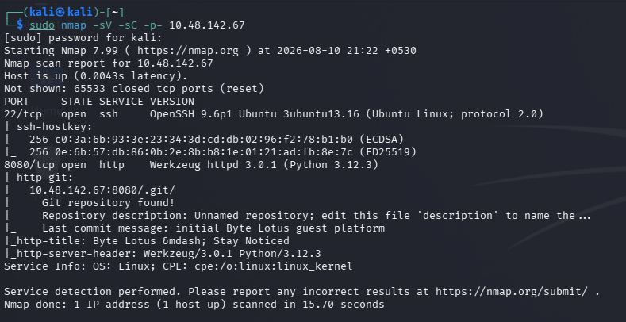
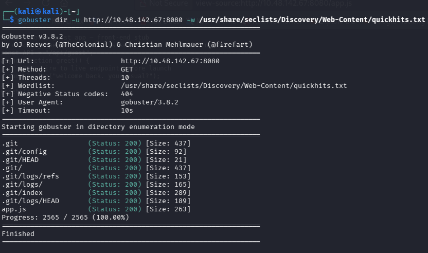
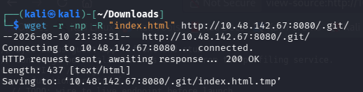
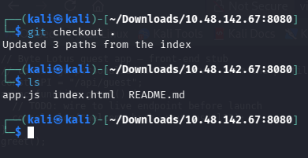
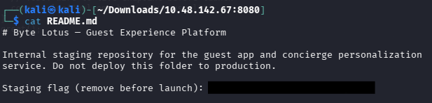

# 2. Room 404

**Category:** Web / Directory Enumeration
**Difficulty:** Easy

Room 404 was a simple web enumeration challenge where the objective was to discover an exposed source repository and retrieve the flag.

---

## 2. Reconnaissance

Simply run a nmap scan to see the port, versions given in the header

```bash
sudo nmap -sV -sC -p- 10.48.142.67
```

So this revealed that 2 ports were open:
- SSH : Port 22
- HTTP : Port 8080

But the most interesting part was an exposed `.git` directory can potentially allow the entire Git repository to be reconstructed.



## 2. Directory Enumeration

So the target was the webserver:

```text
http://10.48.142.67:8080
```

I started with Gobuster just to find if any other usedful directories are there.
I used the SecLists `quickhits.txt` wordlist:

```bash
gobuster dir -u http://10.48.142.67:8080 -w /usr/share/seclists/Discovery/Web-Content/quickhits.txt
```

These are the directories found :

```text
.git
.git/config
.git/HEAD
.git/
.git/logs/refs
.git/logs/
.git/index
.git/logs/HEAD
app.js
```



---

## 3. Downloading the Exposed Git Repository

The JS file didn't had any clue so just downloaded the contents of the `.git` directory to see any clue:

```bash
wget -r -np -R "index.html" http://10.48.142.67:8080/.git/

-r: specify recursive download
-np: don't ascend to the parent directory
-R: comma-separated list of rejected extensions (rejects the auto-generated .html file)
```



After downloading the repository, I moved into the directory containing the Git files.
After searching the whole file, I got nothing which can help

---

## 4. Recovering the Source Code

Since the `.git` directory contained the repository metadata and objects, I used Git command to restore the working tree:

```bash
git checkout .
```

This recovered the files from the repository, including:

```text
index.html
app.js
README.md
```



I then inspected the recovered files.

---

## 5. Finding the Flag

While reviewing the recovered files, I checked `README.md`.

The flag was directly present in the README.



```text
[FLAG REDACTED]
```

---

## 6. Attack Flow

The complete attack chain was:

```text
Target Web Server
      ↓
Gobuster directory enumeration
      ↓
Exposed /.git/
      ↓
Download Git repository
      ↓
git checkout .
      ↓
Recover source files
      ↓
Read README.md
      ↓
Flag
```

---

## 7. Vulnerability

The root cause was an **exposed `.git` directory** on the production web server.

A `.git` directory should not be publicly accessible because it can contain:

* Source code
* Commit history
* Configuration files
* Developer information
* Potential credentials or secrets
* Deleted files that may still exist in Git history

In this challenge, the repository was directly recoverable and contained the flag in `README.md`.

---

## 8. Key Takeaway

Directory enumeration isn't only about finding hidden web pages.

Files and directories such as:

```text
.git
.env
.svn
backup/
config/
```

can expose much more valuable information than normal application endpoints.

For web enumeration, I should always pay attention to **development artifacts accidentally exposed in production**.

### Useful command

```bash
gobuster dir -u http://10.48.142.67:8080 -w /usr/share/seclists/Discovery/Web-Content/quickhits.txt
```

Finding `.git` turned a simple directory-enumeration challenge into a **source-code disclosure**.
