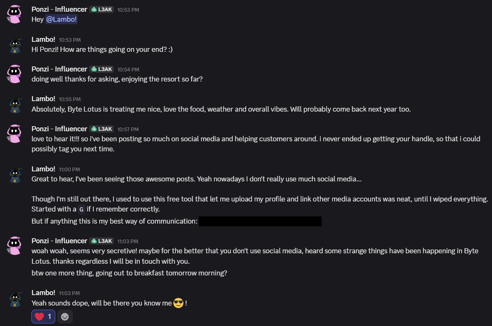
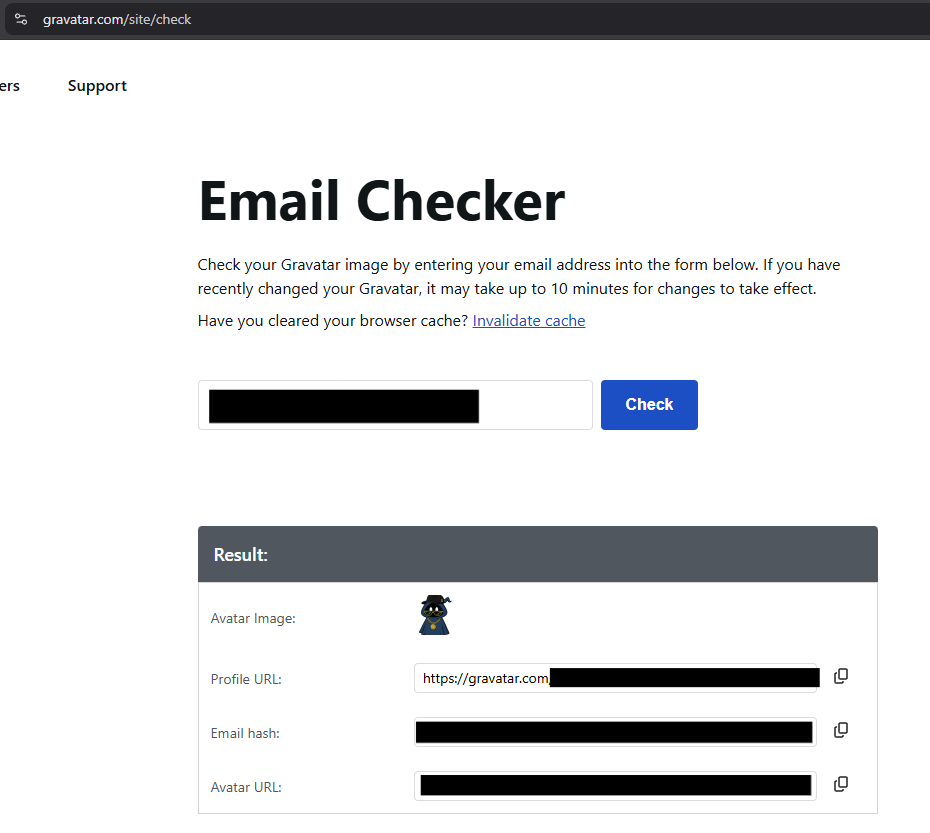
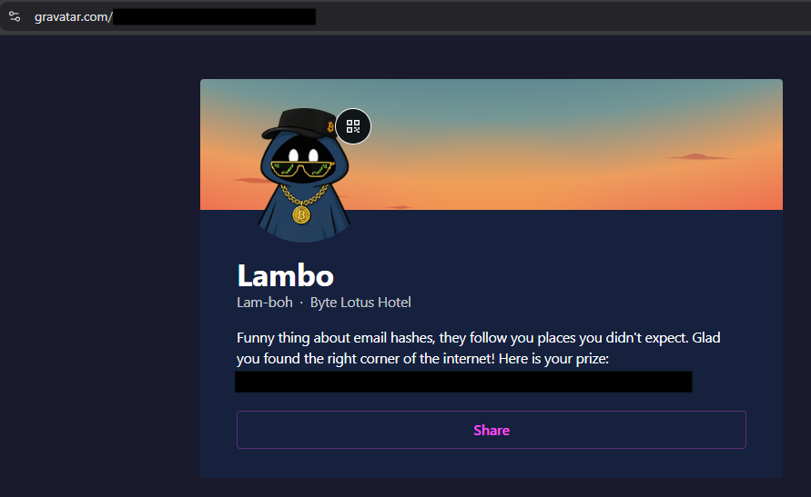

# 6 - Overheard at Breakfast

**Platform:** TryHackMe | **Category:** OSINT | **Difficulty:** Easy

---

## Objective

The goal was to investigate information from a screenshot of a conversation, identify the online service associated with the exposed email address, and recover the hidden flag.

---

## 1. Finding the Email Address

The challenge provided a screenshot containing a conversation.



While reviewing the screenshot, I found an **email address** that appeared to be the main OSINT clue.

I started looking for services that allow users to create a profile, upload a profile picture, and link their social media accounts.

The clue mentioned:

* Free service
* Profile upload
* Social media links
* Service name starts with **G**

---

## 2. Identifying the Service

I searched Google for:

```text
free tool upload profile picture link social media accounts starts with G
```

The service I identified was **Gravatar**.

[Gravatar](https://gravatar.com/?utm_source=chatgpt.com) is a service that allows users to associate profile information with an email address.

---

## 3. Searching the Email on Gravatar

I used the email address discovered in the screenshot with Gravatar's email/profile lookup functionality.

The lookup revealed a hidden profile URL associated with the email address.



The profile URL contained a suspicious-looking encoded string.



---

## 4. Decoding the String

The string appeared to be **Base64 encoded**.

I copied the value into CyberChef and used:

```text
From Base64
```

After decoding it, the resulting value was the flag.

```text
[FLAG REDACTED]
```

---

## Attack / Investigation Chain

```text
Screenshot
    ↓
Find email address
    ↓
Identify clue: free profile/social-linking service
    ↓
Google search
    ↓
Gravatar
    ↓
Search email
    ↓
Find hidden profile
    ↓
Extract Base64 string
    ↓
Decode
    ↓
Flag
```

---

## Key Takeaways

* Small pieces of information in screenshots can be valuable OSINT clues.
* An email address can sometimes be used to discover associated public profiles.
* When a challenge mentions an encoded-looking string, check common encodings such as Base64.
* The important part of this challenge was connecting the **email → Gravatar → hidden profile → Base64 → flag** chain.
