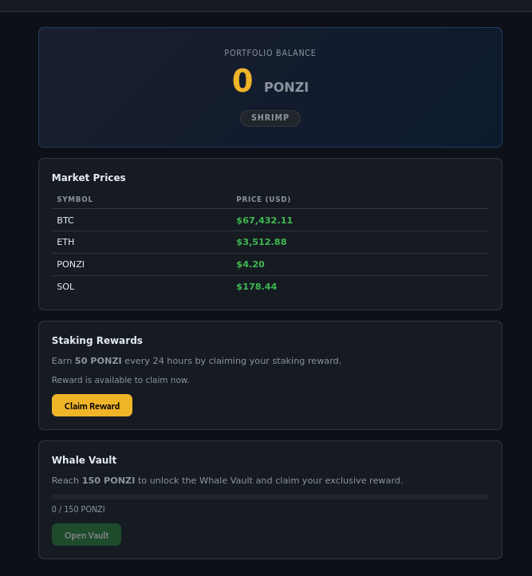
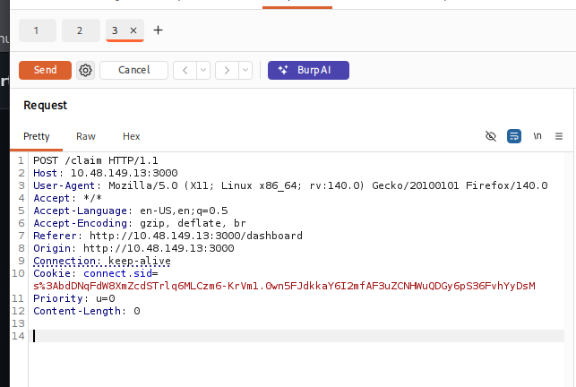
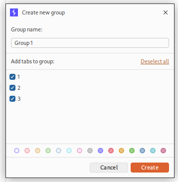
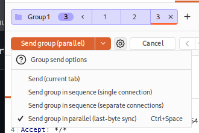
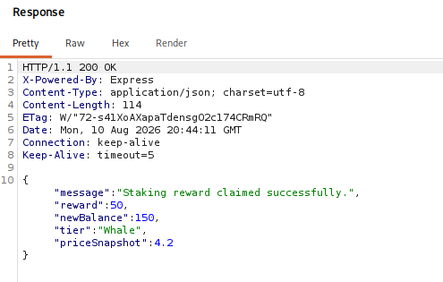

# 8 - Towel on the Sunbed

**Platform:** TryHackMe | **Category:** Web | **Difficulty:** Medium

---

## Objective

The challenge involved a crypto-reward website where guests could claim **50 Ponzi Coins once every 24 hours**.

The `/vault` endpoint contained the flag, but accessing it required at least **150 Ponzi Coins**.

The intended mechanism meant I would normally need to wait three days to reach the required balance.

The challenge was to find a way around this limitation.

---

## 1. Exploring the Application

I created a guest account and explored the application.




The main functionality was a daily reward mechanism:

```text
Claim Reward
     ↓
+50 Ponzi Coins
     ↓
24-hour cooldown
     ↓
Claim again
```

The application showed a countdown after claiming the reward.

The `/vault` page required:

```text
150 Ponzi Coins
```

to unlock the flag.

Normally:

```text
Day 1 → 50 coins
Day 2 → 100 coins
Day 3 → 150 coins
```

So I would have to wait three days.

---

## 2. Investigating the Claim Request

I inspected the network traffic using **Burp Suite** and captured the request generated when clicking the claim button.

The important endpoint was:

```text
POST /claim
```

I sent the request to Burp Suite Repeater.

The application appeared to enforce the daily limit by rejecting additional claims.

When attempting to claim again before the cooldown expired, I received:

```text
HTTP/1.1 429
```

This indicated that the application was correctly detecting repeated requests under normal sequential conditions.

---

## 3. Suspecting a Race Condition

The important question was:

> What happens if multiple `/claim` requests arrive at almost exactly the same time?

A common race-condition pattern occurs when an application performs:

```text
Check eligibility
      ↓
Update balance
      ↓
Update cooldown
```

without making the entire operation atomic.

If multiple requests are processed concurrently, they may all pass the eligibility check before the state is updated.

Conceptually:

```text
Request 1 ──┐
Request 2 ──┼──> Check cooldown → allowed
Request 3 ──┘
                  ↓
              Update balance
```

Instead of:

```text
Request 1 → allowed → update
Request 2 → rejected
Request 3 → rejected
```

multiple requests can potentially be accepted.

---

## 4. Sending Requests in Parallel

I captured **three identical `/claim` requests** and added them to a Burp Suite Repeater group.





Instead of sending them sequentially, I used:

```text
Send group in parallel (last-byte sync)
```



This allowed the requests to be released at nearly the same time.

The three requests effectively raced against the application's reward validation.

---

## 5. Bypassing the Daily Limit

Normally, sending the requests individually resulted in the application rejecting additional claims with:

```text
429 Too Many Requests
```

However, when the three requests were synchronized and sent concurrently, all three were processed successfully.

Each successful request awarded:

```text
50 Ponzi Coins
```

Therefore:

```text
50 + 50 + 50 = 150 Ponzi Coins
```



I obtained the required balance immediately without waiting three days.

---

## 6. Opening the Vault

After obtaining 150 Ponzi Coins, I returned to:

```text
/vault
```

The minimum balance requirement was now satisfied.

The vault opened and revealed the flag.


---

# Attack Chain

```text
Create guest account
        ↓
Explore daily reward
        ↓
Identify /claim endpoint
        ↓
Normal repeated request → 429
        ↓
Suspect race condition
        ↓
Capture 3 /claim requests
        ↓
Burp Repeater group
        ↓
Send group in parallel
        ↓
Last-byte synchronization
        ↓
3 × 50 coins
        ↓
150 Ponzi Coins
        ↓
Open /vault
        ↓
Flag
```

---

# Vulnerability

The vulnerability was a **race condition in the reward-claim business logic**.

The application failed to properly synchronize the eligibility check and reward update.

The intended logic was:

```text
IF cooldown has expired:
    give 50 coins
    start cooldown
ELSE:
    reject
```

But concurrent requests could reach the validation logic before the application's state was updated consistently.

This allowed multiple reward claims during a single cooldown period.

---

# Key Takeaways

* Business logic vulnerabilities don't always involve malformed input or traditional injection.
* Always inspect important state-changing endpoints such as `/claim`, `/transfer`, `/redeem`, and `/withdraw`.
* A request that returns `429` when sent repeatedly may still be vulnerable to concurrent execution.
* Burp Suite's **Repeater groups + parallel sending (last-byte synchronization)** are useful when testing race conditions.
* Rate limiting alone does not necessarily prevent race conditions; the underlying state transition needs to be handled atomically.
